# **Loading Hive Tables and Data Preparation for Analysis**


```python
from pyspark.sql import SparkSession

spark = SparkSession.builder.appName("Subham_Capstone")\
    .config("hive.metastore.uris","thrift://ip-10-1-2-24.ap-south-1.compute.internal:9083")\
    .config("spark.sql.catalogImplementation=hive")\
    .config("spark.sql.warehouse.dir", "hdfs://nameservice1/user/anabig114212/hive/Capstone")\
    .config("spark.serializer", "org.apache.spark.serializer.KryoSerializer")\
    .enableHiveSupport().getOrCreate()
spark
```


    <div>
        <p><b>SparkSession - hive</b></p>

<div>
    <p><b>SparkContext</b></p>

    <p><a href="http://ip-10-1-1-204.ap-south-1.compute.internal:43002">Spark UI</a></p>

    <dl>
      <dt>Version</dt>
        <dd><code>v2.4.0</code></dd>
      <dt>Master</dt>
        <dd><code>local[*]</code></dd>
      <dt>AppName</dt>
        <dd><code>Subham_Capstone</code></dd>
    </dl>
</div>

    </div>


```python
# Importing Libraraies for Analysis

import pandas as pd
import numpy as np
import matplotlib.pyplot as plt
import datetime as dt
import seaborn as sns
import re
from itertools import combinations as cm

#import matplotlib.ticker as ticker
import matplotlib.dates as mdates

# set the graphs to show in the jupyter notebook
%matplotlib inline

# set seabor graphs to a better style
sns.set(style='ticks')

from pyspark.sql.functions import *
import pyspark.sql.functions as F

pd.set_option('display.max_columns', None)
```


```python
# Creating Local Views and Spark Dataframes to call these objects from memory.

departments = spark.table('anabig114212_cap.departments')
departments.createOrReplaceTempView('departments')

titles = spark.table('anabig114212_cap.titles')
titles.createOrReplaceTempView('titles')

employees = spark.table('anabig114212_cap.employees')
employees = employees.withColumn('birth_date', to_date(col('birth_date'),'yyyy-MM-dd'))\
                .withColumn('hire_date', to_date(col('hire_date'),'yyyy-MM-dd'))\
                .withColumn('last_date', to_date(col('last_date'),'yyyy-MM-dd')) #Converting to Proper date formats
employees.createOrReplaceTempView('employees')

dept_emp_raw = spark.table('anabig114212_cap.dept_emp')
dept_emp = spark.table('anabig114212_cap.dept_emp1')
dept_emp.createOrReplaceTempView('dept_emp')

dept_manager = spark.table('anabig114212_cap.dept_manager')
dept_manager.createOrReplaceTempView('dept_manager')

salaries = spark.table('anabig114212_cap.salaries')
salaries.createOrReplaceTempView('salaries')
```

## **Validating Data**


```python
departments.show()
departments.printSchema()
departments.count()
```

    +-------+------------------+
    |dept_no|         dept_name|
    +-------+------------------+
    |   d001|         Marketing|
    |   d002|           Finance|
    |   d003|   Human Resources|
    |   d004|        Production|
    |   d005|       development|
    |   d006|Quality Management|
    |   d007|             Sales|
    |   d008|          Research|
    |   d009|  Customer Service|
    +-------+------------------+
    
    root
     |-- dept_no: string (nullable = true)
     |-- dept_name: string (nullable = true)
    


    9


```python
titles.show()
titles.printSchema()
titles.count()
```

    +--------+------------------+
    |title_id|             title|
    +--------+------------------+
    |   e0001|Assistant Engineer|
    |   e0002|          Engineer|
    |   e0003|   Senior Engineer|
    |   e0004|  Technique Leader|
    |   m0001|           Manager|
    |   s0001|             Staff|
    |   s0002|      Senior Staff|
    +--------+------------------+
    
    root
     |-- title_id: string (nullable = true)
     |-- title: string (nullable = true)
    


    7


```python
employees.printSchema()
employees.count()
```

    root
     |-- emp_no: integer (nullable = true)
     |-- emp_title_id: string (nullable = true)
     |-- birth_date: date (nullable = true)
     |-- first_name: string (nullable = true)
     |-- last_name: string (nullable = true)
     |-- sex: string (nullable = true)
     |-- hire_date: date (nullable = true)
     |-- no_of_projects: integer (nullable = true)
     |-- last_performance_rating: string (nullable = true)
     |-- left2: integer (nullable = true)
     |-- last_date: date (nullable = true)
    


    300024


```python
employees.toPandas().head(20)
```


<div>
<style scoped>
    .dataframe tbody tr th:only-of-type {
        vertical-align: middle;
    }

    .dataframe tbody tr th {
        vertical-align: top;
    }

    .dataframe thead th {
        text-align: right;
    }
</style>
<table border="1" class="dataframe">
  <thead>
    <tr style="text-align: right;">
      <th></th>
      <th>emp_no</th>
      <th>emp_title_id</th>
      <th>birth_date</th>
      <th>first_name</th>
      <th>last_name</th>
      <th>sex</th>
      <th>hire_date</th>
      <th>no_of_projects</th>
      <th>last_performance_rating</th>
      <th>left2</th>
      <th>last_date</th>
    </tr>
  </thead>
  <tbody>
    <tr>
      <th>0</th>
      <td>10001</td>
      <td>e0003</td>
      <td>1953-09-02</td>
      <td>Georgi</td>
      <td>Facello</td>
      <td>M</td>
      <td>1986-06-26</td>
      <td>9</td>
      <td>C</td>
      <td>1</td>
      <td>1994-07-30</td>
    </tr>
    <tr>
      <th>1</th>
      <td>10002</td>
      <td>s0001</td>
      <td>1964-06-02</td>
      <td>Bezalel</td>
      <td>Simmel</td>
      <td>F</td>
      <td>1985-11-21</td>
      <td>8</td>
      <td>B</td>
      <td>0</td>
      <td>None</td>
    </tr>
    <tr>
      <th>2</th>
      <td>10003</td>
      <td>e0003</td>
      <td>1959-12-03</td>
      <td>Parto</td>
      <td>Bamford</td>
      <td>M</td>
      <td>1986-08-28</td>
      <td>1</td>
      <td>C</td>
      <td>0</td>
      <td>None</td>
    </tr>
    <tr>
      <th>3</th>
      <td>10004</td>
      <td>e0003</td>
      <td>1954-05-01</td>
      <td>Chirstian</td>
      <td>Koblick</td>
      <td>M</td>
      <td>1986-12-01</td>
      <td>5</td>
      <td>A</td>
      <td>0</td>
      <td>None</td>
    </tr>
    <tr>
      <th>4</th>
      <td>10005</td>
      <td>s0001</td>
      <td>1955-01-21</td>
      <td>Kyoichi</td>
      <td>Maliniak</td>
      <td>M</td>
      <td>1989-09-12</td>
      <td>6</td>
      <td>A</td>
      <td>0</td>
      <td>None</td>
    </tr>
    <tr>
      <th>5</th>
      <td>10006</td>
      <td>e0003</td>
      <td>1953-04-20</td>
      <td>Anneke</td>
      <td>Preusig</td>
      <td>F</td>
      <td>1989-06-02</td>
      <td>10</td>
      <td>B</td>
      <td>0</td>
      <td>None</td>
    </tr>
    <tr>
      <th>6</th>
      <td>10007</td>
      <td>s0001</td>
      <td>1957-05-23</td>
      <td>Tzvetan</td>
      <td>Zielinski</td>
      <td>F</td>
      <td>1989-02-10</td>
      <td>6</td>
      <td>B</td>
      <td>1</td>
      <td>2002-09-18</td>
    </tr>
    <tr>
      <th>7</th>
      <td>10008</td>
      <td>e0001</td>
      <td>1958-02-19</td>
      <td>Saniya</td>
      <td>Kalloufi</td>
      <td>M</td>
      <td>1994-09-15</td>
      <td>9</td>
      <td>C</td>
      <td>0</td>
      <td>None</td>
    </tr>
    <tr>
      <th>8</th>
      <td>10009</td>
      <td>e0003</td>
      <td>1952-04-19</td>
      <td>Sumant</td>
      <td>Peac</td>
      <td>F</td>
      <td>1985-02-18</td>
      <td>8</td>
      <td>B</td>
      <td>0</td>
      <td>None</td>
    </tr>
    <tr>
      <th>9</th>
      <td>10010</td>
      <td>e0002</td>
      <td>1963-06-01</td>
      <td>Duangkaew</td>
      <td>Piveteau</td>
      <td>F</td>
      <td>1989-08-24</td>
      <td>4</td>
      <td>A</td>
      <td>0</td>
      <td>None</td>
    </tr>
    <tr>
      <th>10</th>
      <td>10011</td>
      <td>s0001</td>
      <td>1953-11-07</td>
      <td>Mary</td>
      <td>Sluis</td>
      <td>F</td>
      <td>1990-01-22</td>
      <td>6</td>
      <td>C</td>
      <td>0</td>
      <td>None</td>
    </tr>
    <tr>
      <th>11</th>
      <td>10012</td>
      <td>e0003</td>
      <td>1960-10-04</td>
      <td>Patricio</td>
      <td>Bridgland</td>
      <td>M</td>
      <td>1992-12-18</td>
      <td>3</td>
      <td>A</td>
      <td>0</td>
      <td>None</td>
    </tr>
    <tr>
      <th>12</th>
      <td>10013</td>
      <td>s0002</td>
      <td>1963-06-07</td>
      <td>Eberhardt</td>
      <td>Terkki</td>
      <td>M</td>
      <td>1985-10-20</td>
      <td>6</td>
      <td>C</td>
      <td>0</td>
      <td>None</td>
    </tr>
    <tr>
      <th>13</th>
      <td>10014</td>
      <td>e0002</td>
      <td>1956-02-12</td>
      <td>Berni</td>
      <td>Genin</td>
      <td>M</td>
      <td>1987-03-11</td>
      <td>9</td>
      <td>B</td>
      <td>0</td>
      <td>None</td>
    </tr>
    <tr>
      <th>14</th>
      <td>10015</td>
      <td>s0002</td>
      <td>1959-08-19</td>
      <td>Guoxiang</td>
      <td>Nooteboom</td>
      <td>M</td>
      <td>1987-07-02</td>
      <td>4</td>
      <td>B</td>
      <td>0</td>
      <td>None</td>
    </tr>
    <tr>
      <th>15</th>
      <td>10016</td>
      <td>s0001</td>
      <td>1961-05-02</td>
      <td>Kazuhito</td>
      <td>Cappelletti</td>
      <td>M</td>
      <td>1995-01-27</td>
      <td>5</td>
      <td>C</td>
      <td>0</td>
      <td>None</td>
    </tr>
    <tr>
      <th>16</th>
      <td>10017</td>
      <td>s0001</td>
      <td>1958-07-06</td>
      <td>Cristinel</td>
      <td>Bouloucos</td>
      <td>F</td>
      <td>1993-08-03</td>
      <td>10</td>
      <td>A</td>
      <td>0</td>
      <td>None</td>
    </tr>
    <tr>
      <th>17</th>
      <td>10018</td>
      <td>e0003</td>
      <td>1954-06-19</td>
      <td>Kazuhide</td>
      <td>Peha</td>
      <td>F</td>
      <td>1987-04-03</td>
      <td>4</td>
      <td>B</td>
      <td>0</td>
      <td>None</td>
    </tr>
    <tr>
      <th>18</th>
      <td>10019</td>
      <td>s0001</td>
      <td>1953-01-23</td>
      <td>Lillian</td>
      <td>Haddadi</td>
      <td>M</td>
      <td>1999-04-30</td>
      <td>4</td>
      <td>B</td>
      <td>0</td>
      <td>None</td>
    </tr>
    <tr>
      <th>19</th>
      <td>10020</td>
      <td>e0002</td>
      <td>1952-12-24</td>
      <td>Mayuko</td>
      <td>Warwick</td>
      <td>M</td>
      <td>1991-01-26</td>
      <td>7</td>
      <td>B</td>
      <td>0</td>
      <td>None</td>
    </tr>
  </tbody>
</table>
</div>


```python
dept_emp_raw.show()
dept_emp_raw.printSchema()
dept_emp_raw.count()
```

    +------+-------+
    |emp_no|dept_no|
    +------+-------+
    | 10001|   d005|
    | 10002|   d007|
    | 10003|   d004|
    | 10004|   d004|
    | 10005|   d003|
    | 10006|   d005|
    | 10007|   d008|
    | 10008|   d005|
    | 10009|   d006|
    | 10010|   d004|
    | 10010|   d006|
    | 10011|   d009|
    | 10012|   d005|
    | 10013|   d003|
    | 10014|   d005|
    | 10015|   d008|
    | 10016|   d007|
    | 10017|   d001|
    | 10018|   d004|
    | 10018|   d005|
    +------+-------+
    only showing top 20 rows
    
    root
     |-- emp_no: integer (nullable = true)
     |-- dept_no: string (nullable = true)
    


    331603


#### dept_emp table was created by removing duplicate emp_no, to keep only the last the department for each employee
[Created in Hive]


```python
dept_emp.show()
dept_emp.printSchema()
dept_emp.count()
```

    +------+-------+
    |emp_no|dept_no|
    +------+-------+
    | 10001|   d005|
    | 10002|   d007|
    | 10003|   d004|
    | 10004|   d004|
    | 10005|   d003|
    | 10006|   d005|
    | 10007|   d008|
    | 10008|   d005|
    | 10009|   d006|
    | 10010|   d006|
    | 10011|   d009|
    | 10012|   d005|
    | 10013|   d003|
    | 10014|   d005|
    | 10015|   d008|
    | 10016|   d007|
    | 10017|   d001|
    | 10018|   d005|
    | 10019|   d008|
    | 10020|   d004|
    +------+-------+
    only showing top 20 rows
    
    root
     |-- emp_no: integer (nullable = true)
     |-- dept_no: string (nullable = true)
    


    300024


```python
dept_manager.show()
dept_manager.printSchema()
dept_manager.count()
```

    +-------+------+
    |dept_no|emp_no|
    +-------+------+
    |   d001|110022|
    |   d001|110039|
    |   d002|110085|
    |   d002|110114|
    |   d003|110183|
    |   d003|110228|
    |   d004|110303|
    |   d004|110344|
    |   d004|110386|
    |   d004|110420|
    |   d005|110511|
    |   d005|110567|
    |   d006|110725|
    |   d006|110765|
    |   d006|110800|
    |   d006|110854|
    |   d007|111035|
    |   d007|111133|
    |   d008|111400|
    |   d008|111534|
    +-------+------+
    only showing top 20 rows
    
    root
     |-- dept_no: string (nullable = true)
     |-- emp_no: integer (nullable = true)
    


    24


```python
salaries.show()
salaries.printSchema()
salaries.count()
```

    +------+------+
    |emp_no|salary|
    +------+------+
    | 10001| 60117|
    | 10002| 65828|
    | 10003| 40006|
    | 10004| 40054|
    | 10005| 78228|
    | 10006| 40000|
    | 10007| 56724|
    | 10008| 46671|
    | 10009| 60929|
    | 10010| 72488|
    | 10011| 42365|
    | 10012| 40000|
    | 10013| 40000|
    | 10014| 46168|
    | 10015| 40000|
    | 10016| 70889|
    | 10017| 71380|
    | 10018| 55881|
    | 10019| 44276|
    | 10020| 40000|
    +------+------+
    only showing top 20 rows
    
    root
     |-- emp_no: integer (nullable = true)
     |-- salary: integer (nullable = true)
    


    300024


### Preparing Employees Table for EDA

#### Maximum date availiable in the Dataset


```python
maxDateInDataset = employees.select(greatest(max(col('last_date')),max(col('hire_date'))))
maxDateInDataset.show()
```

    +----------------------------------------+
    |greatest(max(last_date), max(hire_date))|
    +----------------------------------------+
    |                              2013-03-10|
    +----------------------------------------+
    


```python
maxDateInDataset = employees.select(greatest(max(col('last_date')),max(col('hire_date')))).toPandas().loc[0][0]
employees =  employees.withColumn('Age', maxDateInDataset.year-year(employees.birth_date))\
                .withColumn('Tenure_Years', F.when(col('left2')==1, year(employees.last_date)-year(employees.hire_date))\
                                                  .otherwise(maxDateInDataset.year-year(employees.hire_date)))
employees.createOrReplaceTempView('employees_at')
employees.toPandas().head(20)
```


<div>
<style scoped>
    .dataframe tbody tr th:only-of-type {
        vertical-align: middle;
    }

    .dataframe tbody tr th {
        vertical-align: top;
    }

    .dataframe thead th {
        text-align: right;
    }
</style>
<table border="1" class="dataframe">
  <thead>
    <tr style="text-align: right;">
      <th></th>
      <th>emp_no</th>
      <th>emp_title_id</th>
      <th>birth_date</th>
      <th>first_name</th>
      <th>last_name</th>
      <th>sex</th>
      <th>hire_date</th>
      <th>no_of_projects</th>
      <th>last_performance_rating</th>
      <th>left2</th>
      <th>last_date</th>
      <th>Age</th>
      <th>Tenure_Years</th>
    </tr>
  </thead>
  <tbody>
    <tr>
      <th>0</th>
      <td>10001</td>
      <td>e0003</td>
      <td>1953-09-02</td>
      <td>Georgi</td>
      <td>Facello</td>
      <td>M</td>
      <td>1986-06-26</td>
      <td>9</td>
      <td>C</td>
      <td>1</td>
      <td>1994-07-30</td>
      <td>60</td>
      <td>8</td>
    </tr>
    <tr>
      <th>1</th>
      <td>10002</td>
      <td>s0001</td>
      <td>1964-06-02</td>
      <td>Bezalel</td>
      <td>Simmel</td>
      <td>F</td>
      <td>1985-11-21</td>
      <td>8</td>
      <td>B</td>
      <td>0</td>
      <td>None</td>
      <td>49</td>
      <td>28</td>
    </tr>
    <tr>
      <th>2</th>
      <td>10003</td>
      <td>e0003</td>
      <td>1959-12-03</td>
      <td>Parto</td>
      <td>Bamford</td>
      <td>M</td>
      <td>1986-08-28</td>
      <td>1</td>
      <td>C</td>
      <td>0</td>
      <td>None</td>
      <td>54</td>
      <td>27</td>
    </tr>
    <tr>
      <th>3</th>
      <td>10004</td>
      <td>e0003</td>
      <td>1954-05-01</td>
      <td>Chirstian</td>
      <td>Koblick</td>
      <td>M</td>
      <td>1986-12-01</td>
      <td>5</td>
      <td>A</td>
      <td>0</td>
      <td>None</td>
      <td>59</td>
      <td>27</td>
    </tr>
    <tr>
      <th>4</th>
      <td>10005</td>
      <td>s0001</td>
      <td>1955-01-21</td>
      <td>Kyoichi</td>
      <td>Maliniak</td>
      <td>M</td>
      <td>1989-09-12</td>
      <td>6</td>
      <td>A</td>
      <td>0</td>
      <td>None</td>
      <td>58</td>
      <td>24</td>
    </tr>
    <tr>
      <th>5</th>
      <td>10006</td>
      <td>e0003</td>
      <td>1953-04-20</td>
      <td>Anneke</td>
      <td>Preusig</td>
      <td>F</td>
      <td>1989-06-02</td>
      <td>10</td>
      <td>B</td>
      <td>0</td>
      <td>None</td>
      <td>60</td>
      <td>24</td>
    </tr>
    <tr>
      <th>6</th>
      <td>10007</td>
      <td>s0001</td>
      <td>1957-05-23</td>
      <td>Tzvetan</td>
      <td>Zielinski</td>
      <td>F</td>
      <td>1989-02-10</td>
      <td>6</td>
      <td>B</td>
      <td>1</td>
      <td>2002-09-18</td>
      <td>56</td>
      <td>13</td>
    </tr>
    <tr>
      <th>7</th>
      <td>10008</td>
      <td>e0001</td>
      <td>1958-02-19</td>
      <td>Saniya</td>
      <td>Kalloufi</td>
      <td>M</td>
      <td>1994-09-15</td>
      <td>9</td>
      <td>C</td>
      <td>0</td>
      <td>None</td>
      <td>55</td>
      <td>19</td>
    </tr>
    <tr>
      <th>8</th>
      <td>10009</td>
      <td>e0003</td>
      <td>1952-04-19</td>
      <td>Sumant</td>
      <td>Peac</td>
      <td>F</td>
      <td>1985-02-18</td>
      <td>8</td>
      <td>B</td>
      <td>0</td>
      <td>None</td>
      <td>61</td>
      <td>28</td>
    </tr>
    <tr>
      <th>9</th>
      <td>10010</td>
      <td>e0002</td>
      <td>1963-06-01</td>
      <td>Duangkaew</td>
      <td>Piveteau</td>
      <td>F</td>
      <td>1989-08-24</td>
      <td>4</td>
      <td>A</td>
      <td>0</td>
      <td>None</td>
      <td>50</td>
      <td>24</td>
    </tr>
    <tr>
      <th>10</th>
      <td>10011</td>
      <td>s0001</td>
      <td>1953-11-07</td>
      <td>Mary</td>
      <td>Sluis</td>
      <td>F</td>
      <td>1990-01-22</td>
      <td>6</td>
      <td>C</td>
      <td>0</td>
      <td>None</td>
      <td>60</td>
      <td>23</td>
    </tr>
    <tr>
      <th>11</th>
      <td>10012</td>
      <td>e0003</td>
      <td>1960-10-04</td>
      <td>Patricio</td>
      <td>Bridgland</td>
      <td>M</td>
      <td>1992-12-18</td>
      <td>3</td>
      <td>A</td>
      <td>0</td>
      <td>None</td>
      <td>53</td>
      <td>21</td>
    </tr>
    <tr>
      <th>12</th>
      <td>10013</td>
      <td>s0002</td>
      <td>1963-06-07</td>
      <td>Eberhardt</td>
      <td>Terkki</td>
      <td>M</td>
      <td>1985-10-20</td>
      <td>6</td>
      <td>C</td>
      <td>0</td>
      <td>None</td>
      <td>50</td>
      <td>28</td>
    </tr>
    <tr>
      <th>13</th>
      <td>10014</td>
      <td>e0002</td>
      <td>1956-02-12</td>
      <td>Berni</td>
      <td>Genin</td>
      <td>M</td>
      <td>1987-03-11</td>
      <td>9</td>
      <td>B</td>
      <td>0</td>
      <td>None</td>
      <td>57</td>
      <td>26</td>
    </tr>
    <tr>
      <th>14</th>
      <td>10015</td>
      <td>s0002</td>
      <td>1959-08-19</td>
      <td>Guoxiang</td>
      <td>Nooteboom</td>
      <td>M</td>
      <td>1987-07-02</td>
      <td>4</td>
      <td>B</td>
      <td>0</td>
      <td>None</td>
      <td>54</td>
      <td>26</td>
    </tr>
    <tr>
      <th>15</th>
      <td>10016</td>
      <td>s0001</td>
      <td>1961-05-02</td>
      <td>Kazuhito</td>
      <td>Cappelletti</td>
      <td>M</td>
      <td>1995-01-27</td>
      <td>5</td>
      <td>C</td>
      <td>0</td>
      <td>None</td>
      <td>52</td>
      <td>18</td>
    </tr>
    <tr>
      <th>16</th>
      <td>10017</td>
      <td>s0001</td>
      <td>1958-07-06</td>
      <td>Cristinel</td>
      <td>Bouloucos</td>
      <td>F</td>
      <td>1993-08-03</td>
      <td>10</td>
      <td>A</td>
      <td>0</td>
      <td>None</td>
      <td>55</td>
      <td>20</td>
    </tr>
    <tr>
      <th>17</th>
      <td>10018</td>
      <td>e0003</td>
      <td>1954-06-19</td>
      <td>Kazuhide</td>
      <td>Peha</td>
      <td>F</td>
      <td>1987-04-03</td>
      <td>4</td>
      <td>B</td>
      <td>0</td>
      <td>None</td>
      <td>59</td>
      <td>26</td>
    </tr>
    <tr>
      <th>18</th>
      <td>10019</td>
      <td>s0001</td>
      <td>1953-01-23</td>
      <td>Lillian</td>
      <td>Haddadi</td>
      <td>M</td>
      <td>1999-04-30</td>
      <td>4</td>
      <td>B</td>
      <td>0</td>
      <td>None</td>
      <td>60</td>
      <td>14</td>
    </tr>
    <tr>
      <th>19</th>
      <td>10020</td>
      <td>e0002</td>
      <td>1952-12-24</td>
      <td>Mayuko</td>
      <td>Warwick</td>
      <td>M</td>
      <td>1991-01-26</td>
      <td>7</td>
      <td>B</td>
      <td>0</td>
      <td>None</td>
      <td>61</td>
      <td>22</td>
    </tr>
  </tbody>
</table>
</div>


# **Exploratory Data Analysis**

## **1. A list showing employee number, last name, first name, sex, and salary for each employee**


```python
spark.sql("""
            SELECT e.emp_no, last_name, first_name, sex, salary 
            FROM employees e
            JOIN salaries s  ON e.emp_no = s.emp_no
         """).show()
```

    +------+-----------+----------+---+------+
    |emp_no|  last_name|first_name|sex|salary|
    +------+-----------+----------+---+------+
    | 10001|    Facello|    Georgi|  M| 60117|
    | 10002|     Simmel|   Bezalel|  F| 65828|
    | 10003|    Bamford|     Parto|  M| 40006|
    | 10004|    Koblick| Chirstian|  M| 40054|
    | 10005|   Maliniak|   Kyoichi|  M| 78228|
    | 10006|    Preusig|    Anneke|  F| 40000|
    | 10007|  Zielinski|   Tzvetan|  F| 56724|
    | 10008|   Kalloufi|    Saniya|  M| 46671|
    | 10009|       Peac|    Sumant|  F| 60929|
    | 10010|   Piveteau| Duangkaew|  F| 72488|
    | 10011|      Sluis|      Mary|  F| 42365|
    | 10012|  Bridgland|  Patricio|  M| 40000|
    | 10013|     Terkki| Eberhardt|  M| 40000|
    | 10014|      Genin|     Berni|  M| 46168|
    | 10015|  Nooteboom|  Guoxiang|  M| 40000|
    | 10016|Cappelletti|  Kazuhito|  M| 70889|
    | 10017|  Bouloucos| Cristinel|  F| 71380|
    | 10018|       Peha|  Kazuhide|  F| 55881|
    | 10019|    Haddadi|   Lillian|  M| 44276|
    | 10020|    Warwick|    Mayuko|  M| 40000|
    +------+-----------+----------+---+------+
    only showing top 20 rows
    


```python
employees.join(salaries, on='emp_no').select('emp_no','last_name','first_name','sex','salary').show()
```

    +------+-----------+----------+---+------+
    |emp_no|  last_name|first_name|sex|salary|
    +------+-----------+----------+---+------+
    | 10001|    Facello|    Georgi|  M| 60117|
    | 10002|     Simmel|   Bezalel|  F| 65828|
    | 10003|    Bamford|     Parto|  M| 40006|
    | 10004|    Koblick| Chirstian|  M| 40054|
    | 10005|   Maliniak|   Kyoichi|  M| 78228|
    | 10006|    Preusig|    Anneke|  F| 40000|
    | 10007|  Zielinski|   Tzvetan|  F| 56724|
    | 10008|   Kalloufi|    Saniya|  M| 46671|
    | 10009|       Peac|    Sumant|  F| 60929|
    | 10010|   Piveteau| Duangkaew|  F| 72488|
    | 10011|      Sluis|      Mary|  F| 42365|
    | 10012|  Bridgland|  Patricio|  M| 40000|
    | 10013|     Terkki| Eberhardt|  M| 40000|
    | 10014|      Genin|     Berni|  M| 46168|
    | 10015|  Nooteboom|  Guoxiang|  M| 40000|
    | 10016|Cappelletti|  Kazuhito|  M| 70889|
    | 10017|  Bouloucos| Cristinel|  F| 71380|
    | 10018|       Peha|  Kazuhide|  F| 55881|
    | 10019|    Haddadi|   Lillian|  M| 44276|
    | 10020|    Warwick|    Mayuko|  M| 40000|
    +------+-----------+----------+---+------+
    only showing top 20 rows
    


## **2. A list showing first name, last name, and hire date for employees who were hired in 1986.**


```python
spark.sql("""
            SELECT first_name, last_name, hire_date
            FROM employees
            WHERE year(hire_date) = 1986
         """).show()
```

    +----------+------------+----------+
    |first_name|   last_name| hire_date|
    +----------+------------+----------+
    |    Georgi|     Facello|1986-06-26|
    |     Parto|     Bamford|1986-08-28|
    | Chirstian|     Koblick|1986-12-01|
    |    Sanjiv|    Zschoche|1986-02-04|
    |      Kwee|    Schusler|1986-02-26|
    |   Kshitij|        Gils|1986-03-27|
    |  Zhongwei|       Rosen|1986-10-30|
    |   Xinglin|     Eugenio|1986-09-08|
    | Sudharsan|Flasterstein|1986-08-12|
    |    Kendra|     Hofting|1986-03-14|
    |    Hilari|      Morton|1986-07-15|
    |     Akemi|       Birch|1986-12-02|
    |    Lunjin|      Giveon|1986-10-02|
    |    Xuejia|      Ullian|1986-08-22|
    |   Chikara|    Rissland|1986-01-23|
    |  Domenick|    Peltason|1986-03-14|
    |    Zissis|    Pintelas|1986-02-11|
    |     Perry|   Shimshoni|1986-09-18|
    |  Kazuhito| Encarnacion|1986-08-21|
    |   Xiadong|       Perry|1986-11-05|
    +----------+------------+----------+
    only showing top 20 rows
    


```python
employees[year(col('hire_date'))==1986].select('first_name','last_name','hire_date').show()
```

    +----------+------------+----------+
    |first_name|   last_name| hire_date|
    +----------+------------+----------+
    |    Georgi|     Facello|1986-06-26|
    |     Parto|     Bamford|1986-08-28|
    | Chirstian|     Koblick|1986-12-01|
    |    Sanjiv|    Zschoche|1986-02-04|
    |      Kwee|    Schusler|1986-02-26|
    |   Kshitij|        Gils|1986-03-27|
    |  Zhongwei|       Rosen|1986-10-30|
    |   Xinglin|     Eugenio|1986-09-08|
    | Sudharsan|Flasterstein|1986-08-12|
    |    Kendra|     Hofting|1986-03-14|
    |    Hilari|      Morton|1986-07-15|
    |     Akemi|       Birch|1986-12-02|
    |    Lunjin|      Giveon|1986-10-02|
    |    Xuejia|      Ullian|1986-08-22|
    |   Chikara|    Rissland|1986-01-23|
    |  Domenick|    Peltason|1986-03-14|
    |    Zissis|    Pintelas|1986-02-11|
    |     Perry|   Shimshoni|1986-09-18|
    |  Kazuhito| Encarnacion|1986-08-21|
    |   Xiadong|       Perry|1986-11-05|
    +----------+------------+----------+
    only showing top 20 rows
    


## **3. A list showing the manager of each department with the following information: department number, department name, the manager's employee number, last name, first name.**


```python
spark.sql("""
            SELECT dm.dept_no, d.dept_name, e.emp_no, e.last_name, e.first_name, t.title
            FROM dept_manager dm 
            JOIN departments d ON dm.dept_no = d.dept_no
            JOIN employees e ON dm.emp_no = e.emp_no
            JOIN titles t ON e.emp_title_id = t.title_id AND t.title = 'Manager'
         """).show()
```

    +-------+------------------+------+------------+-----------+-------+
    |dept_no|         dept_name|emp_no|   last_name| first_name|  title|
    +-------+------------------+------+------------+-----------+-------+
    |   d001|         Marketing|110022|  Markovitch|  Margareta|Manager|
    |   d001|         Marketing|110039|    Minakawa|   Vishwani|Manager|
    |   d002|           Finance|110085|       Alpin|       Ebru|Manager|
    |   d002|           Finance|110114|  Legleitner|      Isamu|Manager|
    |   d003|   Human Resources|110183|Ossenbruggen|    Shirish|Manager|
    |   d003|   Human Resources|110228|     Sigstam|    Karsten|Manager|
    |   d004|        Production|110303|     Wegerle|  Krassimir|Manager|
    |   d004|        Production|110344|       Cools|     Rosine|Manager|
    |   d004|        Production|110386|      Kieras|       Shem|Manager|
    |   d004|        Production|110420|    Ghazalie|      Oscar|Manager|
    |   d005|       development|110511|    Hagimont|   DeForest|Manager|
    |   d005|       development|110567|    DasSarma|       Leon|Manager|
    |   d006|Quality Management|110725|     Onuegbe|  Peternela|Manager|
    |   d006|Quality Management|110765|     Hofmeyr|     Rutger|Manager|
    |   d006|Quality Management|110800|     Quadeer|     Sanjoy|Manager|
    |   d006|Quality Management|110854|       Pesch|       Dung|Manager|
    |   d007|             Sales|111035|   Kaelbling|Przemyslawa|Manager|
    |   d007|             Sales|111133|       Zhang|      Hauke|Manager|
    |   d008|          Research|111400|     Staelin|       Arie|Manager|
    |   d008|          Research|111534|      Kambil|     Hilary|Manager|
    +-------+------------------+------+------------+-----------+-------+
    only showing top 20 rows
    


```python
dept_manager.join(departments, on='dept_no')\
    .join(employees, on='emp_no')\
    .join(titles, employees.emp_title_id == titles.title_id)\
    .select('dept_no','dept_name','emp_no','last_name','first_name','title').show()
```

    +-------+------------------+------+------------+-----------+-------+
    |dept_no|         dept_name|emp_no|   last_name| first_name|  title|
    +-------+------------------+------+------------+-----------+-------+
    |   d001|         Marketing|110022|  Markovitch|  Margareta|Manager|
    |   d001|         Marketing|110039|    Minakawa|   Vishwani|Manager|
    |   d002|           Finance|110085|       Alpin|       Ebru|Manager|
    |   d002|           Finance|110114|  Legleitner|      Isamu|Manager|
    |   d003|   Human Resources|110183|Ossenbruggen|    Shirish|Manager|
    |   d003|   Human Resources|110228|     Sigstam|    Karsten|Manager|
    |   d004|        Production|110303|     Wegerle|  Krassimir|Manager|
    |   d004|        Production|110344|       Cools|     Rosine|Manager|
    |   d004|        Production|110386|      Kieras|       Shem|Manager|
    |   d004|        Production|110420|    Ghazalie|      Oscar|Manager|
    |   d005|       development|110511|    Hagimont|   DeForest|Manager|
    |   d005|       development|110567|    DasSarma|       Leon|Manager|
    |   d006|Quality Management|110725|     Onuegbe|  Peternela|Manager|
    |   d006|Quality Management|110765|     Hofmeyr|     Rutger|Manager|
    |   d006|Quality Management|110800|     Quadeer|     Sanjoy|Manager|
    |   d006|Quality Management|110854|       Pesch|       Dung|Manager|
    |   d007|             Sales|111035|   Kaelbling|Przemyslawa|Manager|
    |   d007|             Sales|111133|       Zhang|      Hauke|Manager|
    |   d008|          Research|111400|     Staelin|       Arie|Manager|
    |   d008|          Research|111534|      Kambil|     Hilary|Manager|
    +-------+------------------+------+------------+-----------+-------+
    only showing top 20 rows
    


## **4. A list showing the department of each employee with the following information: employee number, last name, first name, and department name.**


```python
spark.sql("""
            SELECT e.emp_no, last_name, first_name, d.dept_name 
            FROM employees e 
            JOIN dept_emp de ON e.emp_no = de.emp_no 
            JOIN departments d ON de.dept_no = d.dept_no
         """).show()
```

    +------+-----------+----------+------------------+
    |emp_no|  last_name|first_name|         dept_name|
    +------+-----------+----------+------------------+
    | 10001|    Facello|    Georgi|       development|
    | 10002|     Simmel|   Bezalel|             Sales|
    | 10003|    Bamford|     Parto|        Production|
    | 10004|    Koblick| Chirstian|        Production|
    | 10005|   Maliniak|   Kyoichi|   Human Resources|
    | 10006|    Preusig|    Anneke|       development|
    | 10007|  Zielinski|   Tzvetan|          Research|
    | 10008|   Kalloufi|    Saniya|       development|
    | 10009|       Peac|    Sumant|Quality Management|
    | 10010|   Piveteau| Duangkaew|Quality Management|
    | 10011|      Sluis|      Mary|  Customer Service|
    | 10012|  Bridgland|  Patricio|       development|
    | 10013|     Terkki| Eberhardt|   Human Resources|
    | 10014|      Genin|     Berni|       development|
    | 10015|  Nooteboom|  Guoxiang|          Research|
    | 10016|Cappelletti|  Kazuhito|             Sales|
    | 10017|  Bouloucos| Cristinel|         Marketing|
    | 10018|       Peha|  Kazuhide|       development|
    | 10019|    Haddadi|   Lillian|          Research|
    | 10020|    Warwick|    Mayuko|        Production|
    +------+-----------+----------+------------------+
    only showing top 20 rows
    


```python
employees.join(dept_emp, on='emp_no')\
    .join(departments, on='dept_no')\
    .select('emp_no','last_name','first_name','dept_name').show()
```

    +------+-----------+----------+------------------+
    |emp_no|  last_name|first_name|         dept_name|
    +------+-----------+----------+------------------+
    | 10001|    Facello|    Georgi|       development|
    | 10002|     Simmel|   Bezalel|             Sales|
    | 10003|    Bamford|     Parto|        Production|
    | 10004|    Koblick| Chirstian|        Production|
    | 10005|   Maliniak|   Kyoichi|   Human Resources|
    | 10006|    Preusig|    Anneke|       development|
    | 10007|  Zielinski|   Tzvetan|          Research|
    | 10008|   Kalloufi|    Saniya|       development|
    | 10009|       Peac|    Sumant|Quality Management|
    | 10010|   Piveteau| Duangkaew|Quality Management|
    | 10011|      Sluis|      Mary|  Customer Service|
    | 10012|  Bridgland|  Patricio|       development|
    | 10013|     Terkki| Eberhardt|   Human Resources|
    | 10014|      Genin|     Berni|       development|
    | 10015|  Nooteboom|  Guoxiang|          Research|
    | 10016|Cappelletti|  Kazuhito|             Sales|
    | 10017|  Bouloucos| Cristinel|         Marketing|
    | 10018|       Peha|  Kazuhide|       development|
    | 10019|    Haddadi|   Lillian|          Research|
    | 10020|    Warwick|    Mayuko|        Production|
    +------+-----------+----------+------------------+
    only showing top 20 rows
    


## **5. A list showing first name, last name, and sex for employees whose first name is "Hercules" and last names begin with "B"**


```python
spark.sql("""
            SELECT first_name, last_name, sex 
            FROM employees 
            WHERE first_name = 'Hercules' AND last_name LIKE 'B%'
         """).show()
```

    +----------+-------------+---+
    |first_name|    last_name|sex|
    +----------+-------------+---+
    |  Hercules|   Benzmuller|  M|
    |  Hercules|      Brendel|  F|
    |  Hercules|   Baranowski|  M|
    |  Hercules|     Barreiro|  M|
    |  Hercules|         Baer|  M|
    |  Hercules|Bernardinello|  F|
    |  Hercules|      Basagni|  M|
    |  Hercules|        Biran|  F|
    |  Hercules|    Bernatsky|  M|
    |  Hercules|         Bail|  F|
    |  Hercules|        Birge|  F|
    |  Hercules|      Bisiani|  F|
    |  Hercules|       Bodoff|  M|
    |  Hercules|        Biron|  F|
    |  Hercules|      Buchter|  M|
    |  Hercules|         Bain|  F|
    |  Hercules|         Bahr|  M|
    |  Hercules|         Baak|  M|
    |  Hercules|     Benantar|  F|
    |  Hercules|      Berstel|  F|
    +----------+-------------+---+
    


```python
employees[(col('first_name') == 'Hercules') & (col('last_name').like('B%'))]\
    .select('first_name','last_name','sex').show()
```

    +----------+-------------+---+
    |first_name|    last_name|sex|
    +----------+-------------+---+
    |  Hercules|   Benzmuller|  M|
    |  Hercules|      Brendel|  F|
    |  Hercules|   Baranowski|  M|
    |  Hercules|     Barreiro|  M|
    |  Hercules|         Baer|  M|
    |  Hercules|Bernardinello|  F|
    |  Hercules|      Basagni|  M|
    |  Hercules|        Biran|  F|
    |  Hercules|    Bernatsky|  M|
    |  Hercules|         Bail|  F|
    |  Hercules|        Birge|  F|
    |  Hercules|      Bisiani|  F|
    |  Hercules|       Bodoff|  M|
    |  Hercules|        Biron|  F|
    |  Hercules|      Buchter|  M|
    |  Hercules|         Bain|  F|
    |  Hercules|         Bahr|  M|
    |  Hercules|         Baak|  M|
    |  Hercules|     Benantar|  F|
    |  Hercules|      Berstel|  F|
    +----------+-------------+---+
    


## **6. A list showing all employees in the Sales department, including their employee number, last name, first name, and department name.**


```python
spark.sql("""
            SELECT e.emp_no, e.last_name, e.first_name, d.dept_name
            FROM employees e 
            JOIN dept_emp de ON e.emp_no = de.emp_no 
            JOIN departments d ON de.dept_no = d.dept_no AND d.dept_name = 'Sales'
         """).show()
```

    +------+------------+----------+---------+
    |emp_no|   last_name|first_name|dept_name|
    +------+------------+----------+---------+
    | 10002|      Simmel|   Bezalel|    Sales|
    | 10016| Cappelletti|  Kazuhito|    Sales|
    | 10034|        Swan|     Bader|    Sales|
    | 10041|      Lenart|       Uri|    Sales|
    | 10050|      Dredge|   Yinghua|    Sales|
    | 10053|    Zschoche|    Sanjiv|    Sales|
    | 10061|      Herber|       Tse|    Sales|
    | 10068|     Brattka|  Charlene|    Sales|
    | 10087|     Eugenio|   Xinglin|    Sales|
    | 10089|Flasterstein| Sudharsan|    Sales|
    | 10093|     Desikan|   Sailaja|    Sales|
    | 10095|      Morton|    Hilari|    Sales|
    | 10099|     Sullins|    Valter|    Sales|
    | 10101|      Heyers|     Perla|    Sales|
    | 10107|        Baca|      Dung|    Sales|
    | 10125|     Hiltgen|     Syozo|    Sales|
    | 10136|    Pintelas|    Zissis|    Sales|
    | 10148|       Azumi|    Douadi|    Sales|
    | 10149|       Perry|   Xiadong|    Sales|
    | 10151|    Lichtner|   Itzchak|    Sales|
    +------+------------+----------+---------+
    only showing top 20 rows
    


```python
employees.join(dept_emp, on='emp_no')\
    .join(departments[col('dept_name')=='Sales'], on='dept_no')\
    .select('emp_no','last_name','first_name','dept_name').show()
```

    +------+------------+----------+---------+
    |emp_no|   last_name|first_name|dept_name|
    +------+------------+----------+---------+
    | 10002|      Simmel|   Bezalel|    Sales|
    | 10016| Cappelletti|  Kazuhito|    Sales|
    | 10034|        Swan|     Bader|    Sales|
    | 10041|      Lenart|       Uri|    Sales|
    | 10050|      Dredge|   Yinghua|    Sales|
    | 10053|    Zschoche|    Sanjiv|    Sales|
    | 10061|      Herber|       Tse|    Sales|
    | 10068|     Brattka|  Charlene|    Sales|
    | 10087|     Eugenio|   Xinglin|    Sales|
    | 10089|Flasterstein| Sudharsan|    Sales|
    | 10093|     Desikan|   Sailaja|    Sales|
    | 10095|      Morton|    Hilari|    Sales|
    | 10099|     Sullins|    Valter|    Sales|
    | 10101|      Heyers|     Perla|    Sales|
    | 10107|        Baca|      Dung|    Sales|
    | 10125|     Hiltgen|     Syozo|    Sales|
    | 10136|    Pintelas|    Zissis|    Sales|
    | 10148|       Azumi|    Douadi|    Sales|
    | 10149|       Perry|   Xiadong|    Sales|
    | 10151|    Lichtner|   Itzchak|    Sales|
    +------+------------+----------+---------+
    only showing top 20 rows
    


## **7. A list showing all employees in the Sales and Development departments, including their employee number, last name, first name, and department name.**


```python
spark.sql("""
            SELECT e.emp_no, e.last_name, e.first_name, d.dept_name
            FROM employees e 
            JOIN dept_emp de ON e.emp_no = de.emp_no 
            JOIN departments d ON de.dept_no = d.dept_no AND d.dept_name IN ('Sales','development')
         """).show()
```

    +------+-----------+----------+-----------+
    |emp_no|  last_name|first_name|  dept_name|
    +------+-----------+----------+-----------+
    | 10001|    Facello|    Georgi|development|
    | 10002|     Simmel|   Bezalel|      Sales|
    | 10006|    Preusig|    Anneke|development|
    | 10008|   Kalloufi|    Saniya|development|
    | 10012|  Bridgland|  Patricio|development|
    | 10014|      Genin|     Berni|development|
    | 10016|Cappelletti|  Kazuhito|      Sales|
    | 10018|       Peha|  Kazuhide|development|
    | 10021|       Erde|     Ramzi|development|
    | 10022|     Famili|    Shahaf|development|
    | 10023| Montemayor|     Bojan|development|
    | 10025|     Heyers| Prasadram|development|
    | 10027|    Reistad|    Divier|development|
    | 10028|   Tempesti|  Domenick|development|
    | 10031|     Joslin|   Karsten|development|
    | 10034|       Swan|     Bader|      Sales|
    | 10037|   Makrucki|   Pradeep|development|
    | 10041|     Lenart|       Uri|      Sales|
    | 10043|    Tzvieli|    Yishay|development|
    | 10048|   Syrotiuk|   Florian|development|
    +------+-----------+----------+-----------+
    only showing top 20 rows
    


```python
employees.join(dept_emp, on='emp_no')\
    .join(departments[col('dept_name').isin('Sales','development')], on='dept_no')\
    .select('emp_no','last_name','first_name','dept_name').show()
```

    +------+-----------+----------+-----------+
    |emp_no|  last_name|first_name|  dept_name|
    +------+-----------+----------+-----------+
    | 10001|    Facello|    Georgi|development|
    | 10002|     Simmel|   Bezalel|      Sales|
    | 10006|    Preusig|    Anneke|development|
    | 10008|   Kalloufi|    Saniya|development|
    | 10012|  Bridgland|  Patricio|development|
    | 10014|      Genin|     Berni|development|
    | 10016|Cappelletti|  Kazuhito|      Sales|
    | 10018|       Peha|  Kazuhide|development|
    | 10021|       Erde|     Ramzi|development|
    | 10022|     Famili|    Shahaf|development|
    | 10023| Montemayor|     Bojan|development|
    | 10025|     Heyers| Prasadram|development|
    | 10027|    Reistad|    Divier|development|
    | 10028|   Tempesti|  Domenick|development|
    | 10031|     Joslin|   Karsten|development|
    | 10034|       Swan|     Bader|      Sales|
    | 10037|   Makrucki|   Pradeep|development|
    | 10041|     Lenart|       Uri|      Sales|
    | 10043|    Tzvieli|    Yishay|development|
    | 10048|   Syrotiuk|   Florian|development|
    +------+-----------+----------+-----------+
    only showing top 20 rows
    


## **8. A list showing the frequency count of employee last names, in descending order. ( i.e., how many employees share each last name**


```python
spark.sql("""
            SELECT last_name, count(*) AS Last_name_cnt
            FROM employees
            GROUP BY last_name
            ORDER BY Last_name_cnt DESC
         """).show()
```

    +-----------+-------------+
    |  last_name|Last_name_cnt|
    +-----------+-------------+
    |       Baba|          226|
    |     Gelosh|          223|
    |      Coorg|          223|
    |     Farris|          222|
    |    Sudbeck|          222|
    |     Adachi|          221|
    |     Osgood|          220|
    |     Neiman|          218|
    |    Mandell|          218|
    |     Masada|          218|
    |Boudaillier|          217|
    |    Wendorf|          217|
    |   Cummings|          216|
    |     Pettis|          216|
    |    Solares|          216|
    |     Mahnke|          216|
    |     Emmart|          215|
    |    Kulisch|          215|
    |   Birjandi|          215|
    | Maksimenko|          215|
    +-----------+-------------+
    only showing top 20 rows
    


```python
employees.groupBy('last_name').agg(count('emp_no').alias('Last_name_cnt'))\
    .orderBy(col('Last_name_cnt').desc()).show()
```

    +-----------+-------------+
    |  last_name|Last_name_cnt|
    +-----------+-------------+
    |       Baba|          226|
    |     Gelosh|          223|
    |      Coorg|          223|
    |    Sudbeck|          222|
    |     Farris|          222|
    |     Adachi|          221|
    |     Osgood|          220|
    |     Masada|          218|
    |     Neiman|          218|
    |    Mandell|          218|
    |Boudaillier|          217|
    |    Wendorf|          217|
    |    Solares|          216|
    |   Cummings|          216|
    |     Pettis|          216|
    |     Mahnke|          216|
    |   Collette|          215|
    |     Emmart|          215|
    |   Birjandi|          215|
    |    Kulisch|          215|
    +-----------+-------------+
    only showing top 20 rows
    


## **9. Histogram to show the salary distribution among the employees**


```python
sns.set(rc={"figure.figsize": (10, 6)})
sns.distplot(salaries.select('salary').toPandas(), norm_hist=True)
plt.show()
```


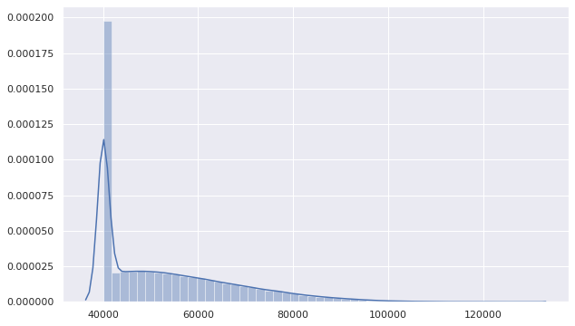


```python
plt.hist(salaries.select('salary').toPandas().values)
plt.xlabel('Salaries')
plt.ylabel('Counts of Employess')
plt.show()
```


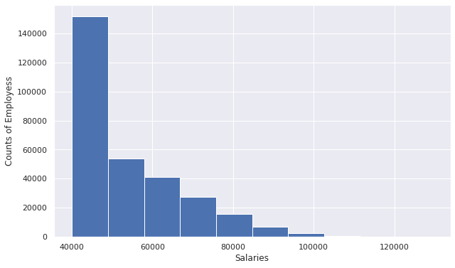


## **10. Bar graph to show the Average salary per title (designation)**


```python
q10 = spark.sql("""
            SELECT 
                t.title, 
                avg(Salary) Avg_Salary, 
                max(Salary) Max_Salary, 
                min(Salary) Min_Salary
            FROM salaries s
            JOIN employees e ON s.emp_no = e.emp_no
            JOIN titles t ON e.emp_title_id = t.title_id
            GROUP BY t.title
         """).toPandas()
q10.head(10)
```


<div>
<style scoped>
    .dataframe tbody tr th:only-of-type {
        vertical-align: middle;
    }

    .dataframe tbody tr th {
        vertical-align: top;
    }

    .dataframe thead th {
        text-align: right;
    }
</style>
<table border="1" class="dataframe">
  <thead>
    <tr style="text-align: right;">
      <th></th>
      <th>title</th>
      <th>Avg_Salary</th>
      <th>Max_Salary</th>
      <th>Min_Salary</th>
    </tr>
  </thead>
  <tbody>
    <tr>
      <th>0</th>
      <td>Staff</td>
      <td>58465.382850</td>
      <td>129492</td>
      <td>40000</td>
    </tr>
    <tr>
      <th>1</th>
      <td>Assistant Engineer</td>
      <td>48564.434447</td>
      <td>99683</td>
      <td>40000</td>
    </tr>
    <tr>
      <th>2</th>
      <td>Senior Staff</td>
      <td>58550.172704</td>
      <td>127238</td>
      <td>40000</td>
    </tr>
    <tr>
      <th>3</th>
      <td>Senior Engineer</td>
      <td>48506.799871</td>
      <td>110449</td>
      <td>40000</td>
    </tr>
    <tr>
      <th>4</th>
      <td>Engineer</td>
      <td>48535.336511</td>
      <td>100683</td>
      <td>40000</td>
    </tr>
    <tr>
      <th>5</th>
      <td>Manager</td>
      <td>51531.041667</td>
      <td>72446</td>
      <td>40000</td>
    </tr>
    <tr>
      <th>6</th>
      <td>Technique Leader</td>
      <td>48582.896092</td>
      <td>104065</td>
      <td>40000</td>
    </tr>
  </tbody>
</table>
</div>


```python
sns.set(rc={"figure.figsize": (15, 6)})
sns.barplot(data=q10, x='title', y='Avg_Salary')
plt.show()
```


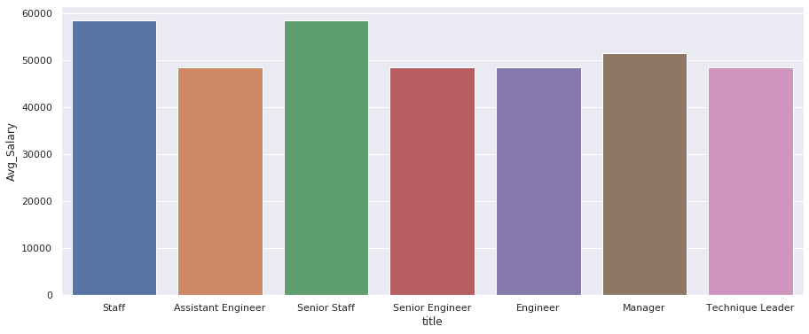


## **11. Calculate employee tenure & show the tenure distribution among the employees**


```python
q11 = spark.sql("""
           SELECT 
                CASE WHEN last_date IS NULL 
                     THEN (SELECT year(greatest(max(last_date), max(hire_date))) FROM employees)-year(hire_date)
                ELSE year(last_date)-year(hire_date) END AS Tenure_Years, 
                count(*) AS Tenure_cnt
            FROM employees
            GROUP BY Tenure_Years
            ORDER BY Tenure_cnt DESC
         """).toPandas()
q11.head()
```


<div>
<style scoped>
    .dataframe tbody tr th:only-of-type {
        vertical-align: middle;
    }

    .dataframe tbody tr th {
        vertical-align: top;
    }

    .dataframe thead th {
        text-align: right;
    }
</style>
<table border="1" class="dataframe">
  <thead>
    <tr style="text-align: right;">
      <th></th>
      <th>Tenure_Years</th>
      <th>Tenure_cnt</th>
    </tr>
  </thead>
  <tbody>
    <tr>
      <th>0</th>
      <td>27</td>
      <td>32530</td>
    </tr>
    <tr>
      <th>1</th>
      <td>28</td>
      <td>31832</td>
    </tr>
    <tr>
      <th>2</th>
      <td>26</td>
      <td>30175</td>
    </tr>
    <tr>
      <th>3</th>
      <td>25</td>
      <td>28210</td>
    </tr>
    <tr>
      <th>4</th>
      <td>24</td>
      <td>25607</td>
    </tr>
  </tbody>
</table>
</div>


```python
employees.groupBy('Tenure_Years').agg(count('emp_no').alias('Tenure_cnt'))\
    .orderBy(col('Tenure_cnt').desc()).toPandas().head()
```


<div>
<style scoped>
    .dataframe tbody tr th:only-of-type {
        vertical-align: middle;
    }

    .dataframe tbody tr th {
        vertical-align: top;
    }

    .dataframe thead th {
        text-align: right;
    }
</style>
<table border="1" class="dataframe">
  <thead>
    <tr style="text-align: right;">
      <th></th>
      <th>Tenure_Years</th>
      <th>Tenure_cnt</th>
    </tr>
  </thead>
  <tbody>
    <tr>
      <th>0</th>
      <td>27</td>
      <td>32530</td>
    </tr>
    <tr>
      <th>1</th>
      <td>28</td>
      <td>31832</td>
    </tr>
    <tr>
      <th>2</th>
      <td>26</td>
      <td>30175</td>
    </tr>
    <tr>
      <th>3</th>
      <td>25</td>
      <td>28210</td>
    </tr>
    <tr>
      <th>4</th>
      <td>24</td>
      <td>25607</td>
    </tr>
  </tbody>
</table>
</div>


```python
sns.set(rc={"figure.figsize": (15, 6)})
sns.barplot(data=q11, x='Tenure_Years', y='Tenure_cnt',\
           order=q11.sort_values('Tenure_cnt',ascending = False).Tenure_Years)
plt.show()
```


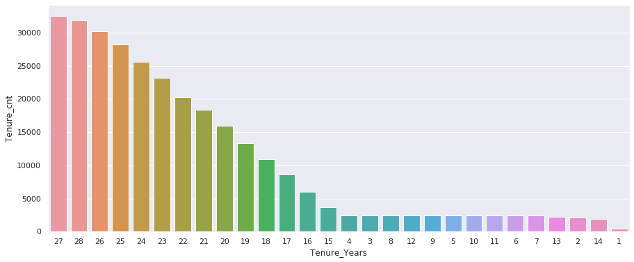


## **12. Count of Employee Status (Currently working or Left) in different departments grouped by gender**


```python
spark.sql("""
            SELECT
                dept_name, sex,
                count(Left2) Total_Count,
                sum(CASE WHEN Left2 = 0 THEN 1 ELSE 0 END) Working_Count,
                sum(Left2) Left_Count
            FROM Employees e
            JOIN dept_emp de ON e.emp_no = de.emp_no
            JOIN departments d ON de.dept_no = d.dept_no
            GROUP BY dept_name, sex
         """).show()
```

    +------------------+---+-----------+-------------+----------+
    |         dept_name|sex|Total_Count|Working_Count|Left_Count|
    +------------------+---+-----------+-------------+----------+
    |Quality Management|  M|      12039|        10839|      1200|
    |           Finance|  F|       5961|         5388|       573|
    |   Human Resources|  M|      10711|         9635|      1076|
    |Quality Management|  F|       8078|         7260|       818|
    |   Human Resources|  F|       7075|         6354|       721|
    |             Sales|  M|      29810|        26755|      3055|
    |  Customer Service|  M|      14132|        12713|      1419|
    |       development|  M|      47277|        42512|      4765|
    |         Marketing|  F|       5850|         5304|       546|
    |          Research|  F|       8439|         7601|       838|
    |        Production|  F|      23912|        21460|      2452|
    |          Research|  M|      12687|        11427|      1260|
    |           Finance|  M|       8756|         7929|       827|
    |             Sales|  F|      19851|        17954|      1897|
    |  Customer Service|  F|       9448|         8453|       995|
    |       development|  F|      31437|        28370|      3067|
    |        Production|  M|      35577|        32069|      3508|
    |         Marketing|  M|       8984|         8134|       850|
    +------------------+---+-----------+-------------+----------+
    


# 13. Max, Min and Avg age of Employees in diffrent departments


```python
spark.sql("""
           SELECT dept_name, min(Age), max(Age), avg(Age)
           FROM (
            SELECT
                dept_name, e.emp_no,
                    (SELECT year(greatest(max(last_date), max(hire_date))) FROM Employees)-year(birth_date) Age
            FROM employees e
            JOIN dept_emp de ON e.emp_no = de.emp_no
            JOIN departments d ON de.dept_no = d.dept_no 
            )a
          GROUP BY dept_name
         """).show()
```

    +------------------+--------+--------+------------------+
    |         dept_name|min(Age)|max(Age)|          avg(Age)|
    +------------------+--------+--------+------------------+
    |             Sales|      48|      61| 54.91617164374459|
    |Quality Management|      48|      61| 54.94397773027787|
    |           Finance|      48|      61|  54.9266154786981|
    |        Production|      48|      61| 54.93388693708081|
    |          Research|      48|      61|54.902821168228726|
    |  Customer Service|      48|      61| 54.91675148430873|
    |         Marketing|      48|      61| 54.92153161655656|
    |       development|      48|      61|  54.8962446324669|
    |   Human Resources|      48|      61| 54.94900483526369|
    +------------------+--------+--------+------------------+
    


The Age group distribution is very uniform accross all the departments. 

# 14. Count of Employees in various titles


```python
q14 = spark.sql("""
            SELECT 
                t.title, 
                count(Salary) Emp_Count
            FROM salaries s
            JOIN employees e ON s.emp_no = e.emp_no
            JOIN titles t ON e.emp_title_id = t.title_id
            GROUP BY t.title
            ORDER BY Emp_Count DESC
         """).toPandas()
q14.head(10)
```


<div>
<style scoped>
    .dataframe tbody tr th:only-of-type {
        vertical-align: middle;
    }

    .dataframe tbody tr th {
        vertical-align: top;
    }

    .dataframe thead th {
        text-align: right;
    }
</style>
<table border="1" class="dataframe">
  <thead>
    <tr style="text-align: right;">
      <th></th>
      <th>title</th>
      <th>Emp_Count</th>
    </tr>
  </thead>
  <tbody>
    <tr>
      <th>0</th>
      <td>Staff</td>
      <td>107384</td>
    </tr>
    <tr>
      <th>1</th>
      <td>Senior Engineer</td>
      <td>97747</td>
    </tr>
    <tr>
      <th>2</th>
      <td>Engineer</td>
      <td>47303</td>
    </tr>
    <tr>
      <th>3</th>
      <td>Senior Staff</td>
      <td>26583</td>
    </tr>
    <tr>
      <th>4</th>
      <td>Technique Leader</td>
      <td>15148</td>
    </tr>
    <tr>
      <th>5</th>
      <td>Assistant Engineer</td>
      <td>5835</td>
    </tr>
    <tr>
      <th>6</th>
      <td>Manager</td>
      <td>24</td>
    </tr>
  </tbody>
</table>
</div>


```python
sns.set(rc={"figure.figsize": (15, 6)})
sns.barplot(data=q14, x='title', y='Emp_Count')
plt.show()
```


# 15 Average Tenure Distribution accross Departments


```python
q15 = spark.sql("""
            SELECT 
                dept_name, 
                avg(Tenure_Years) Tenure
            FROM employees_at e
            JOIN dept_emp de ON e.emp_no = de.emp_no
            JOIN departments d ON de.dept_no = d.dept_no
            GROUP BY dept_name
            ORDER BY Tenure DESC
         """).toPandas()
q15.head(10)
```


<div>
<style scoped>
    .dataframe tbody tr th:only-of-type {
        vertical-align: middle;
    }

    .dataframe tbody tr th {
        vertical-align: top;
    }

    .dataframe thead th {
        text-align: right;
    }
</style>
<table border="1" class="dataframe">
  <thead>
    <tr style="text-align: right;">
      <th></th>
      <th>dept_name</th>
      <th>Tenure</th>
    </tr>
  </thead>
  <tbody>
    <tr>
      <th>0</th>
      <td>Finance</td>
      <td>21.911123</td>
    </tr>
    <tr>
      <th>1</th>
      <td>Marketing</td>
      <td>21.899285</td>
    </tr>
    <tr>
      <th>2</th>
      <td>Research</td>
      <td>21.864480</td>
    </tr>
    <tr>
      <th>3</th>
      <td>Production</td>
      <td>21.835213</td>
    </tr>
    <tr>
      <th>4</th>
      <td>Sales</td>
      <td>21.832484</td>
    </tr>
    <tr>
      <th>5</th>
      <td>development</td>
      <td>21.829598</td>
    </tr>
    <tr>
      <th>6</th>
      <td>Quality Management</td>
      <td>21.800517</td>
    </tr>
    <tr>
      <th>7</th>
      <td>Customer Service</td>
      <td>21.790967</td>
    </tr>
    <tr>
      <th>8</th>
      <td>Human Resources</td>
      <td>21.787473</td>
    </tr>
  </tbody>
</table>
</div>


```python
sns.set(rc={"figure.figsize": (15, 6)})
sns.barplot(data=q15, x='dept_name', y='Tenure')
plt.show()
```


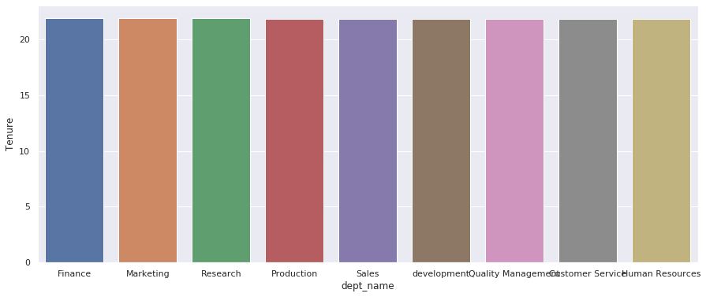


# 16 Average Tenure Distribution accross Titles


```python
q16 = spark.sql("""
            SELECT 
                title, 
                avg(Tenure_Years) Tenure
            FROM employees_at e
            JOIN titles t ON e.emp_title_id = t.title_id
            GROUP BY title
            ORDER BY Tenure DESC
         """).toPandas()
q16.head(10)
```


<div>
<style scoped>
    .dataframe tbody tr th:only-of-type {
        vertical-align: middle;
    }

    .dataframe tbody tr th {
        vertical-align: top;
    }

    .dataframe thead th {
        text-align: right;
    }
</style>
<table border="1" class="dataframe">
  <thead>
    <tr style="text-align: right;">
      <th></th>
      <th>title</th>
      <th>Tenure</th>
    </tr>
  </thead>
  <tbody>
    <tr>
      <th>0</th>
      <td>Manager</td>
      <td>24.666667</td>
    </tr>
    <tr>
      <th>1</th>
      <td>Senior Engineer</td>
      <td>22.490163</td>
    </tr>
    <tr>
      <th>2</th>
      <td>Senior Staff</td>
      <td>21.867961</td>
    </tr>
    <tr>
      <th>3</th>
      <td>Staff</td>
      <td>21.830664</td>
    </tr>
    <tr>
      <th>4</th>
      <td>Technique Leader</td>
      <td>21.810536</td>
    </tr>
    <tr>
      <th>5</th>
      <td>Engineer</td>
      <td>20.638416</td>
    </tr>
    <tr>
      <th>6</th>
      <td>Assistant Engineer</td>
      <td>20.470094</td>
    </tr>
  </tbody>
</table>
</div>


```python
sns.set(rc={"figure.figsize": (15, 6)})
sns.barplot(data=q16, x='title', y='Tenure')
plt.show()
```


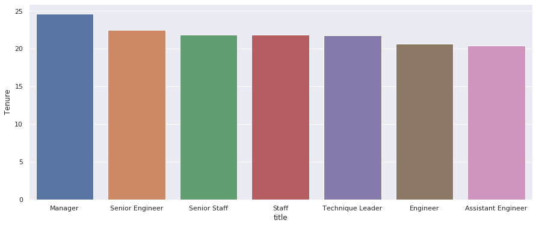


# **Building Spark ML Model and Pipeline**

## **Creating Final Dataframe**


```python
# Joining employees, salaries, departments, titles
emp_tsd = employees.join(titles, employees.emp_title_id == titles.title_id)\
    .join(salaries, on='emp_no')\
    .join(dept_emp, on='emp_no')\
    .join(departments, on='dept_no')\
    .withColumnRenamed('left2', 'left')
emp_tsd.toPandas().head(10)
```


<div>
<style scoped>
    .dataframe tbody tr th:only-of-type {
        vertical-align: middle;
    }

    .dataframe tbody tr th {
        vertical-align: top;
    }

    .dataframe thead th {
        text-align: right;
    }
</style>
<table border="1" class="dataframe">
  <thead>
    <tr style="text-align: right;">
      <th></th>
      <th>dept_no</th>
      <th>emp_no</th>
      <th>emp_title_id</th>
      <th>birth_date</th>
      <th>first_name</th>
      <th>last_name</th>
      <th>sex</th>
      <th>hire_date</th>
      <th>no_of_projects</th>
      <th>last_performance_rating</th>
      <th>left</th>
      <th>last_date</th>
      <th>Age</th>
      <th>Tenure_Years</th>
      <th>title_id</th>
      <th>title</th>
      <th>salary</th>
      <th>dept_name</th>
    </tr>
  </thead>
  <tbody>
    <tr>
      <th>0</th>
      <td>d005</td>
      <td>10001</td>
      <td>e0003</td>
      <td>1953-09-02</td>
      <td>Georgi</td>
      <td>Facello</td>
      <td>M</td>
      <td>1986-06-26</td>
      <td>9</td>
      <td>C</td>
      <td>1</td>
      <td>1994-07-30</td>
      <td>60</td>
      <td>8</td>
      <td>e0003</td>
      <td>Senior Engineer</td>
      <td>60117</td>
      <td>development</td>
    </tr>
    <tr>
      <th>1</th>
      <td>d007</td>
      <td>10002</td>
      <td>s0001</td>
      <td>1964-06-02</td>
      <td>Bezalel</td>
      <td>Simmel</td>
      <td>F</td>
      <td>1985-11-21</td>
      <td>8</td>
      <td>B</td>
      <td>0</td>
      <td>None</td>
      <td>49</td>
      <td>28</td>
      <td>s0001</td>
      <td>Staff</td>
      <td>65828</td>
      <td>Sales</td>
    </tr>
    <tr>
      <th>2</th>
      <td>d004</td>
      <td>10003</td>
      <td>e0003</td>
      <td>1959-12-03</td>
      <td>Parto</td>
      <td>Bamford</td>
      <td>M</td>
      <td>1986-08-28</td>
      <td>1</td>
      <td>C</td>
      <td>0</td>
      <td>None</td>
      <td>54</td>
      <td>27</td>
      <td>e0003</td>
      <td>Senior Engineer</td>
      <td>40006</td>
      <td>Production</td>
    </tr>
    <tr>
      <th>3</th>
      <td>d004</td>
      <td>10004</td>
      <td>e0003</td>
      <td>1954-05-01</td>
      <td>Chirstian</td>
      <td>Koblick</td>
      <td>M</td>
      <td>1986-12-01</td>
      <td>5</td>
      <td>A</td>
      <td>0</td>
      <td>None</td>
      <td>59</td>
      <td>27</td>
      <td>e0003</td>
      <td>Senior Engineer</td>
      <td>40054</td>
      <td>Production</td>
    </tr>
    <tr>
      <th>4</th>
      <td>d003</td>
      <td>10005</td>
      <td>s0001</td>
      <td>1955-01-21</td>
      <td>Kyoichi</td>
      <td>Maliniak</td>
      <td>M</td>
      <td>1989-09-12</td>
      <td>6</td>
      <td>A</td>
      <td>0</td>
      <td>None</td>
      <td>58</td>
      <td>24</td>
      <td>s0001</td>
      <td>Staff</td>
      <td>78228</td>
      <td>Human Resources</td>
    </tr>
    <tr>
      <th>5</th>
      <td>d005</td>
      <td>10006</td>
      <td>e0003</td>
      <td>1953-04-20</td>
      <td>Anneke</td>
      <td>Preusig</td>
      <td>F</td>
      <td>1989-06-02</td>
      <td>10</td>
      <td>B</td>
      <td>0</td>
      <td>None</td>
      <td>60</td>
      <td>24</td>
      <td>e0003</td>
      <td>Senior Engineer</td>
      <td>40000</td>
      <td>development</td>
    </tr>
    <tr>
      <th>6</th>
      <td>d008</td>
      <td>10007</td>
      <td>s0001</td>
      <td>1957-05-23</td>
      <td>Tzvetan</td>
      <td>Zielinski</td>
      <td>F</td>
      <td>1989-02-10</td>
      <td>6</td>
      <td>B</td>
      <td>1</td>
      <td>2002-09-18</td>
      <td>56</td>
      <td>13</td>
      <td>s0001</td>
      <td>Staff</td>
      <td>56724</td>
      <td>Research</td>
    </tr>
    <tr>
      <th>7</th>
      <td>d005</td>
      <td>10008</td>
      <td>e0001</td>
      <td>1958-02-19</td>
      <td>Saniya</td>
      <td>Kalloufi</td>
      <td>M</td>
      <td>1994-09-15</td>
      <td>9</td>
      <td>C</td>
      <td>0</td>
      <td>None</td>
      <td>55</td>
      <td>19</td>
      <td>e0001</td>
      <td>Assistant Engineer</td>
      <td>46671</td>
      <td>development</td>
    </tr>
    <tr>
      <th>8</th>
      <td>d006</td>
      <td>10009</td>
      <td>e0003</td>
      <td>1952-04-19</td>
      <td>Sumant</td>
      <td>Peac</td>
      <td>F</td>
      <td>1985-02-18</td>
      <td>8</td>
      <td>B</td>
      <td>0</td>
      <td>None</td>
      <td>61</td>
      <td>28</td>
      <td>e0003</td>
      <td>Senior Engineer</td>
      <td>60929</td>
      <td>Quality Management</td>
    </tr>
    <tr>
      <th>9</th>
      <td>d006</td>
      <td>10010</td>
      <td>e0002</td>
      <td>1963-06-01</td>
      <td>Duangkaew</td>
      <td>Piveteau</td>
      <td>F</td>
      <td>1989-08-24</td>
      <td>4</td>
      <td>A</td>
      <td>0</td>
      <td>None</td>
      <td>50</td>
      <td>24</td>
      <td>e0002</td>
      <td>Engineer</td>
      <td>72488</td>
      <td>Quality Management</td>
    </tr>
  </tbody>
</table>
</div>


```python
emp_tsd.count()
```


    300024


```python
dfp = emp_tsd.toPandas()
dfp.dtypes
```


    dept_no                    object
    emp_no                      int32
    emp_title_id               object
    birth_date                 object
    first_name                 object
    last_name                  object
    sex                        object
    hire_date                  object
    no_of_projects              int32
    last_performance_rating    object
    left                        int32
    last_date                  object
    Age                         int32
    Tenure_Years                int32
    title_id                   object
    title                      object
    salary                      int32
    dept_name                  object
    dtype: object


```python
conti_var_df = dfp.loc[:, (dfp.dtypes == 'float64') | (dfp.dtypes == 'int64') | (dfp.dtypes == 'int32')]
cat_var_df = dfp.loc[:, (dfp.dtypes == 'object')]
```

### Continous Variables


```python
def fun_describe(x):

    # Records and missing values
    n_tot = x.shape[0]
    n_count = x.count()
    n_miss = x.isna().sum()
    n_miss_perc = n_miss / n_tot

    # IQR
    q1 = x.quantile(0.25)
    q3 = x.quantile(0.75)
    iqr = q3 - q1
    lc_iqr = q1 - 1.5 * iqr
    uc_iqr = q3 + 1.5 * iqr

    return pd.Series(data=[
        x.dtypes, n_tot, n_count, n_miss, n_miss_perc,
        x.nunique(),
        x.sum(),
        x.mean(),
        x.std(),
        x.var(), iqr, lc_iqr, uc_iqr,
        x.min(),
        x.max(),
        x.quantile(0.01),
        x.quantile(0.05),
        x.quantile(0.1),
        x.quantile(0.25),
        x.quantile(0.5),
        x.quantile(0.75),
        x.quantile(0.90),
        x.quantile(0.95),
        x.quantile(0.99)
    ],
        index=[
        'dtype', 'tot', 'n', 'nmiss', 'miss_perc',
        'cardinality', 'sum', 'mean', 'std', 'var', 'iqr',
        'lc_iqr', 'uc_iqr', 'min', 'max', 'p1', 'p5', 'p10',
        'p25', 'p50', 'p75', 'p90', 'p95', 'p99'
    ])
conti_var_df.apply(fun_describe).T
```


<div>
<style scoped>
    .dataframe tbody tr th:only-of-type {
        vertical-align: middle;
    }

    .dataframe tbody tr th {
        vertical-align: top;
    }

    .dataframe thead th {
        text-align: right;
    }
</style>
<table border="1" class="dataframe">
  <thead>
    <tr style="text-align: right;">
      <th></th>
      <th>dtype</th>
      <th>tot</th>
      <th>n</th>
      <th>nmiss</th>
      <th>miss_perc</th>
      <th>cardinality</th>
      <th>sum</th>
      <th>mean</th>
      <th>std</th>
      <th>var</th>
      <th>iqr</th>
      <th>lc_iqr</th>
      <th>uc_iqr</th>
      <th>min</th>
      <th>max</th>
      <th>p1</th>
      <th>p5</th>
      <th>p10</th>
      <th>p25</th>
      <th>p50</th>
      <th>p75</th>
      <th>p90</th>
      <th>p95</th>
      <th>p99</th>
    </tr>
  </thead>
  <tbody>
    <tr>
      <th>emp_no</th>
      <td>int32</td>
      <td>300024</td>
      <td>300024</td>
      <td>0</td>
      <td>0</td>
      <td>300024</td>
      <td>76002608740</td>
      <td>253322</td>
      <td>161828</td>
      <td>2.61884e+10</td>
      <td>339986</td>
      <td>-424973</td>
      <td>934973</td>
      <td>10001</td>
      <td>499999</td>
      <td>13001.2</td>
      <td>25002.2</td>
      <td>40003.3</td>
      <td>85006.8</td>
      <td>249988</td>
      <td>424993</td>
      <td>469997</td>
      <td>484998</td>
      <td>496999</td>
    </tr>
    <tr>
      <th>no_of_projects</th>
      <td>int32</td>
      <td>300024</td>
      <td>300024</td>
      <td>0</td>
      <td>0</td>
      <td>10</td>
      <td>1651580</td>
      <td>5.50483</td>
      <td>2.87207</td>
      <td>8.24881</td>
      <td>5</td>
      <td>-4.5</td>
      <td>15.5</td>
      <td>1</td>
      <td>10</td>
      <td>1</td>
      <td>1</td>
      <td>2</td>
      <td>3</td>
      <td>6</td>
      <td>8</td>
      <td>10</td>
      <td>10</td>
      <td>10</td>
    </tr>
    <tr>
      <th>left</th>
      <td>int32</td>
      <td>300024</td>
      <td>300024</td>
      <td>0</td>
      <td>0</td>
      <td>2</td>
      <td>29867</td>
      <td>0.0995487</td>
      <td>0.299398</td>
      <td>0.0896391</td>
      <td>0</td>
      <td>0</td>
      <td>0</td>
      <td>0</td>
      <td>1</td>
      <td>0</td>
      <td>0</td>
      <td>0</td>
      <td>0</td>
      <td>0</td>
      <td>0</td>
      <td>0</td>
      <td>1</td>
      <td>1</td>
    </tr>
    <tr>
      <th>Age</th>
      <td>int32</td>
      <td>300024</td>
      <td>300024</td>
      <td>0</td>
      <td>0</td>
      <td>14</td>
      <td>16476763</td>
      <td>54.9181</td>
      <td>3.74869</td>
      <td>14.0527</td>
      <td>6</td>
      <td>43</td>
      <td>67</td>
      <td>48</td>
      <td>61</td>
      <td>49</td>
      <td>49</td>
      <td>50</td>
      <td>52</td>
      <td>55</td>
      <td>58</td>
      <td>60</td>
      <td>61</td>
      <td>61</td>
    </tr>
    <tr>
      <th>Tenure_Years</th>
      <td>int32</td>
      <td>300024</td>
      <td>300024</td>
      <td>0</td>
      <td>0</td>
      <td>28</td>
      <td>6550606</td>
      <td>21.8336</td>
      <td>5.92815</td>
      <td>35.1429</td>
      <td>6</td>
      <td>11</td>
      <td>35</td>
      <td>1</td>
      <td>28</td>
      <td>3</td>
      <td>8</td>
      <td>14</td>
      <td>20</td>
      <td>23</td>
      <td>26</td>
      <td>28</td>
      <td>28</td>
      <td>28</td>
    </tr>
    <tr>
      <th>salary</th>
      <td>int32</td>
      <td>300024</td>
      <td>300024</td>
      <td>0</td>
      <td>0</td>
      <td>50355</td>
      <td>15892491033</td>
      <td>52970.7</td>
      <td>14301.5</td>
      <td>2.04532e+08</td>
      <td>21758</td>
      <td>7363</td>
      <td>94395</td>
      <td>40000</td>
      <td>129492</td>
      <td>40000</td>
      <td>40000</td>
      <td>40000</td>
      <td>40000</td>
      <td>48681</td>
      <td>61758</td>
      <td>74177</td>
      <td>81444.8</td>
      <td>94388</td>
    </tr>
  </tbody>
</table>
</div>


Here, 'emp_no' is having numeric datatype but not a variable to be considered as it has maximum cardinality i.e. primary key, used for identification only. 

### Categorical Variables


```python
def fun_obj_describe(x):

    # Records and missing values
    n_tot = x.shape[0]
    n_count = x.count()
    n_miss = x.isna().sum()
    n_miss_perc = n_miss / n_tot

    return pd.Series(data=[
        x.dtypes, n_tot, n_count, n_miss, n_miss_perc,
        x.nunique()
    ],
        index=[
        'dtype', 'tot', 'n', 'nmiss', 'miss_perc',
        'cardinality'
    ])

cat_var_df.apply(fun_obj_describe).T
```


<div>
<style scoped>
    .dataframe tbody tr th:only-of-type {
        vertical-align: middle;
    }

    .dataframe tbody tr th {
        vertical-align: top;
    }

    .dataframe thead th {
        text-align: right;
    }
</style>
<table border="1" class="dataframe">
  <thead>
    <tr style="text-align: right;">
      <th></th>
      <th>dtype</th>
      <th>tot</th>
      <th>n</th>
      <th>nmiss</th>
      <th>miss_perc</th>
      <th>cardinality</th>
    </tr>
  </thead>
  <tbody>
    <tr>
      <th>dept_no</th>
      <td>object</td>
      <td>300024</td>
      <td>300024</td>
      <td>0</td>
      <td>0</td>
      <td>9</td>
    </tr>
    <tr>
      <th>emp_title_id</th>
      <td>object</td>
      <td>300024</td>
      <td>300024</td>
      <td>0</td>
      <td>0</td>
      <td>7</td>
    </tr>
    <tr>
      <th>birth_date</th>
      <td>object</td>
      <td>300024</td>
      <td>300024</td>
      <td>0</td>
      <td>0</td>
      <td>4750</td>
    </tr>
    <tr>
      <th>first_name</th>
      <td>object</td>
      <td>300024</td>
      <td>300024</td>
      <td>0</td>
      <td>0</td>
      <td>1276</td>
    </tr>
    <tr>
      <th>last_name</th>
      <td>object</td>
      <td>300024</td>
      <td>300024</td>
      <td>0</td>
      <td>0</td>
      <td>1638</td>
    </tr>
    <tr>
      <th>sex</th>
      <td>object</td>
      <td>300024</td>
      <td>300024</td>
      <td>0</td>
      <td>0</td>
      <td>2</td>
    </tr>
    <tr>
      <th>hire_date</th>
      <td>object</td>
      <td>300024</td>
      <td>300024</td>
      <td>0</td>
      <td>0</td>
      <td>5434</td>
    </tr>
    <tr>
      <th>last_performance_rating</th>
      <td>object</td>
      <td>300024</td>
      <td>300024</td>
      <td>0</td>
      <td>0</td>
      <td>5</td>
    </tr>
    <tr>
      <th>last_date</th>
      <td>object</td>
      <td>300024</td>
      <td>29867</td>
      <td>270157</td>
      <td>0.900451</td>
      <td>7582</td>
    </tr>
    <tr>
      <th>title_id</th>
      <td>object</td>
      <td>300024</td>
      <td>300024</td>
      <td>0</td>
      <td>0</td>
      <td>7</td>
    </tr>
    <tr>
      <th>title</th>
      <td>object</td>
      <td>300024</td>
      <td>300024</td>
      <td>0</td>
      <td>0</td>
      <td>7</td>
    </tr>
    <tr>
      <th>dept_name</th>
      <td>object</td>
      <td>300024</td>
      <td>300024</td>
      <td>0</td>
      <td>0</td>
      <td>9</td>
    </tr>
  </tbody>
</table>
</div>


Encoding columns with high cardinality may effect the model, so all of these categorical cols with high cardinality will be dropped later.

## Checking Dependencies


```python
for col in emp_tsd.toPandas().columns:
  try:
    sns.lmplot(x= col, y='left', data=emp_tsd.toPandas())
    plt.show()
  except:
    pass
```


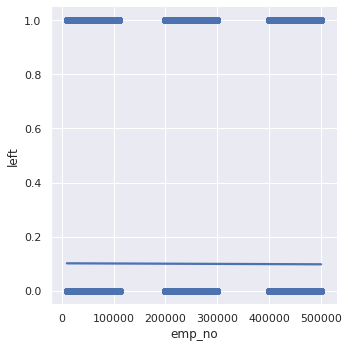


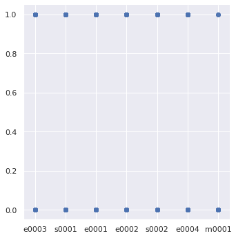


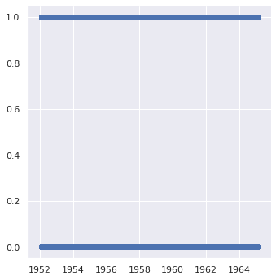


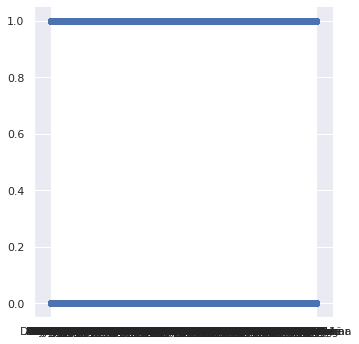


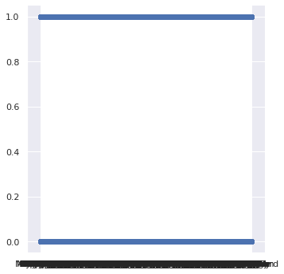


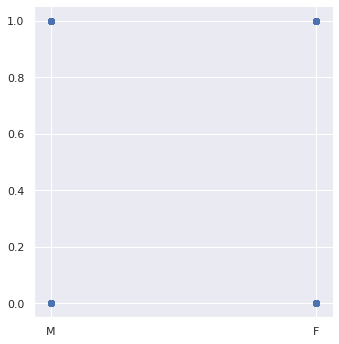


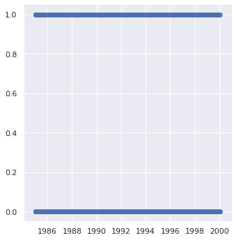


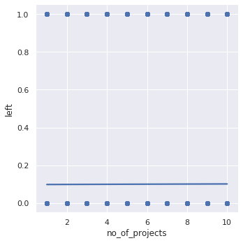


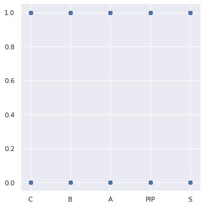


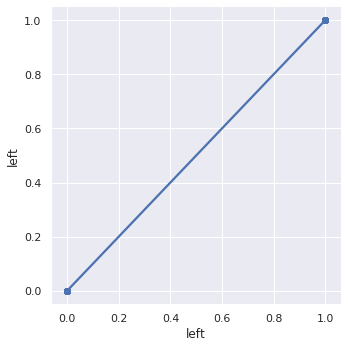


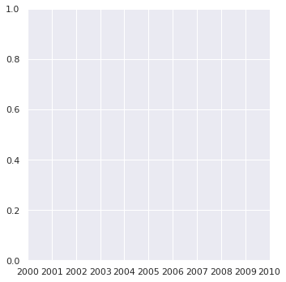


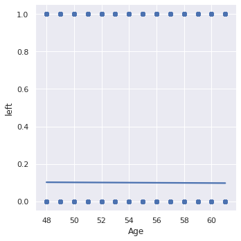


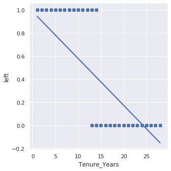


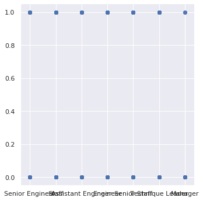


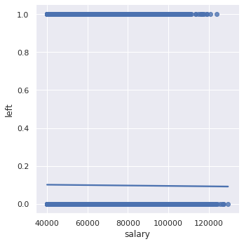


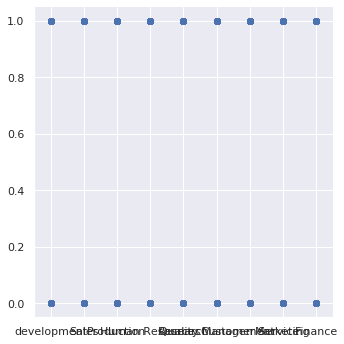


Dropping these following columns since these do not seem to have any effect in Employee Left Status :
'emp_title_id','birth_date','last_date','hire_date','emp_no','title_id','dept_no','first_name','last_name'


```python
df = emp_tsd.drop('emp_title_id','birth_date','last_date','hire_date'\
                  ,'emp_no','title_id','dept_no','first_name','last_name')
df.toPandas().head(20)
```


<div>
<style scoped>
    .dataframe tbody tr th:only-of-type {
        vertical-align: middle;
    }

    .dataframe tbody tr th {
        vertical-align: top;
    }

    .dataframe thead th {
        text-align: right;
    }
</style>
<table border="1" class="dataframe">
  <thead>
    <tr style="text-align: right;">
      <th></th>
      <th>sex</th>
      <th>no_of_projects</th>
      <th>last_performance_rating</th>
      <th>left</th>
      <th>Age</th>
      <th>Tenure_Years</th>
      <th>title</th>
      <th>salary</th>
      <th>dept_name</th>
    </tr>
  </thead>
  <tbody>
    <tr>
      <th>0</th>
      <td>M</td>
      <td>9</td>
      <td>C</td>
      <td>1</td>
      <td>60</td>
      <td>8</td>
      <td>Senior Engineer</td>
      <td>60117</td>
      <td>development</td>
    </tr>
    <tr>
      <th>1</th>
      <td>F</td>
      <td>8</td>
      <td>B</td>
      <td>0</td>
      <td>49</td>
      <td>28</td>
      <td>Staff</td>
      <td>65828</td>
      <td>Sales</td>
    </tr>
    <tr>
      <th>2</th>
      <td>M</td>
      <td>1</td>
      <td>C</td>
      <td>0</td>
      <td>54</td>
      <td>27</td>
      <td>Senior Engineer</td>
      <td>40006</td>
      <td>Production</td>
    </tr>
    <tr>
      <th>3</th>
      <td>M</td>
      <td>5</td>
      <td>A</td>
      <td>0</td>
      <td>59</td>
      <td>27</td>
      <td>Senior Engineer</td>
      <td>40054</td>
      <td>Production</td>
    </tr>
    <tr>
      <th>4</th>
      <td>M</td>
      <td>6</td>
      <td>A</td>
      <td>0</td>
      <td>58</td>
      <td>24</td>
      <td>Staff</td>
      <td>78228</td>
      <td>Human Resources</td>
    </tr>
    <tr>
      <th>5</th>
      <td>F</td>
      <td>10</td>
      <td>B</td>
      <td>0</td>
      <td>60</td>
      <td>24</td>
      <td>Senior Engineer</td>
      <td>40000</td>
      <td>development</td>
    </tr>
    <tr>
      <th>6</th>
      <td>F</td>
      <td>6</td>
      <td>B</td>
      <td>1</td>
      <td>56</td>
      <td>13</td>
      <td>Staff</td>
      <td>56724</td>
      <td>Research</td>
    </tr>
    <tr>
      <th>7</th>
      <td>M</td>
      <td>9</td>
      <td>C</td>
      <td>0</td>
      <td>55</td>
      <td>19</td>
      <td>Assistant Engineer</td>
      <td>46671</td>
      <td>development</td>
    </tr>
    <tr>
      <th>8</th>
      <td>F</td>
      <td>8</td>
      <td>B</td>
      <td>0</td>
      <td>61</td>
      <td>28</td>
      <td>Senior Engineer</td>
      <td>60929</td>
      <td>Quality Management</td>
    </tr>
    <tr>
      <th>9</th>
      <td>F</td>
      <td>4</td>
      <td>A</td>
      <td>0</td>
      <td>50</td>
      <td>24</td>
      <td>Engineer</td>
      <td>72488</td>
      <td>Quality Management</td>
    </tr>
    <tr>
      <th>10</th>
      <td>F</td>
      <td>6</td>
      <td>C</td>
      <td>0</td>
      <td>60</td>
      <td>23</td>
      <td>Staff</td>
      <td>42365</td>
      <td>Customer Service</td>
    </tr>
    <tr>
      <th>11</th>
      <td>M</td>
      <td>3</td>
      <td>A</td>
      <td>0</td>
      <td>53</td>
      <td>21</td>
      <td>Senior Engineer</td>
      <td>40000</td>
      <td>development</td>
    </tr>
    <tr>
      <th>12</th>
      <td>M</td>
      <td>6</td>
      <td>C</td>
      <td>0</td>
      <td>50</td>
      <td>28</td>
      <td>Senior Staff</td>
      <td>40000</td>
      <td>Human Resources</td>
    </tr>
    <tr>
      <th>13</th>
      <td>M</td>
      <td>9</td>
      <td>B</td>
      <td>0</td>
      <td>57</td>
      <td>26</td>
      <td>Engineer</td>
      <td>46168</td>
      <td>development</td>
    </tr>
    <tr>
      <th>14</th>
      <td>M</td>
      <td>4</td>
      <td>B</td>
      <td>0</td>
      <td>54</td>
      <td>26</td>
      <td>Senior Staff</td>
      <td>40000</td>
      <td>Research</td>
    </tr>
    <tr>
      <th>15</th>
      <td>M</td>
      <td>5</td>
      <td>C</td>
      <td>0</td>
      <td>52</td>
      <td>18</td>
      <td>Staff</td>
      <td>70889</td>
      <td>Sales</td>
    </tr>
    <tr>
      <th>16</th>
      <td>F</td>
      <td>10</td>
      <td>A</td>
      <td>0</td>
      <td>55</td>
      <td>20</td>
      <td>Staff</td>
      <td>71380</td>
      <td>Marketing</td>
    </tr>
    <tr>
      <th>17</th>
      <td>F</td>
      <td>4</td>
      <td>B</td>
      <td>0</td>
      <td>59</td>
      <td>26</td>
      <td>Senior Engineer</td>
      <td>55881</td>
      <td>development</td>
    </tr>
    <tr>
      <th>18</th>
      <td>M</td>
      <td>4</td>
      <td>B</td>
      <td>0</td>
      <td>60</td>
      <td>14</td>
      <td>Staff</td>
      <td>44276</td>
      <td>Research</td>
    </tr>
    <tr>
      <th>19</th>
      <td>M</td>
      <td>7</td>
      <td>B</td>
      <td>0</td>
      <td>61</td>
      <td>22</td>
      <td>Engineer</td>
      <td>40000</td>
      <td>Production</td>
    </tr>
  </tbody>
</table>
</div>


```python
df.printSchema()
```

    root
     |-- sex: string (nullable = true)
     |-- no_of_projects: integer (nullable = true)
     |-- last_performance_rating: string (nullable = true)
     |-- left: integer (nullable = true)
     |-- Age: integer (nullable = true)
     |-- Tenure_Years: integer (nullable = true)
     |-- title: string (nullable = true)
     |-- salary: integer (nullable = true)
     |-- dept_name: string (nullable = true)
    


## **Data Preparation for Modeling**

### Label Encoding :

#### last_performance_rating :


```python
df.select('last_performance_rating').distinct().show()
```

    +-----------------------+
    |last_performance_rating|
    +-----------------------+
    |                      B|
    |                      C|
    |                      A|
    |                      S|
    |                    PIP|
    +-----------------------+
    


Considering the the order as S > A > B > C > PIP, Encoding values as S = 5, A = 4, B = 3, C = 2, PIP = 1


```python
df = df.withColumn('last_performance_rating', F.when(df.last_performance_rating=='S',5)\
                                               .when(df.last_performance_rating=='A',4)\
                                               .when(df.last_performance_rating=='B',3)\
                                               .when(df.last_performance_rating=='C',2)\
                                               .otherwise(1))
```

#### title :


```python
df.select('title').distinct().show()
```

    +------------------+
    |             title|
    +------------------+
    |             Staff|
    |Assistant Engineer|
    |      Senior Staff|
    |   Senior Engineer|
    |          Engineer|
    |           Manager|
    |  Technique Leader|
    +------------------+
    


Considering the the order as Staff < Senior Staff < Assistant Engineer < Engineer < Senior Engineer < Technique Leader < Manager, Encoding values as Manager = 7, Technique Leader = 6, Senior Engineer = 5, Engineer = 4, Assistant Engineer = 3, Senior Staff = 2, Staff = 1


```python
df = df.withColumn('title', F.when(df.title=='Manager',7)\
                             .when(df.title=='Technique Leader',6)\
                             .when(df.title=='Senior Engineer',5)\
                             .when(df.title=='Engineer',4)\
                             .when(df.title=='Assistant Engineer',3)\
                             .when(df.title=='Senior Staff',2)\
                             .otherwise(1))
```


```python
df.show()
```

    +---+--------------+-----------------------+----+---+------------+-----+------+------------------+
    |sex|no_of_projects|last_performance_rating|left|Age|Tenure_Years|title|salary|         dept_name|
    +---+--------------+-----------------------+----+---+------------+-----+------+------------------+
    |  M|             9|                      2|   1| 60|           8|    5| 60117|       development|
    |  F|             8|                      3|   0| 49|          28|    1| 65828|             Sales|
    |  M|             1|                      2|   0| 54|          27|    5| 40006|        Production|
    |  M|             5|                      4|   0| 59|          27|    5| 40054|        Production|
    |  M|             6|                      4|   0| 58|          24|    1| 78228|   Human Resources|
    |  F|            10|                      3|   0| 60|          24|    5| 40000|       development|
    |  F|             6|                      3|   1| 56|          13|    1| 56724|          Research|
    |  M|             9|                      2|   0| 55|          19|    3| 46671|       development|
    |  F|             8|                      3|   0| 61|          28|    5| 60929|Quality Management|
    |  F|             4|                      4|   0| 50|          24|    4| 72488|Quality Management|
    |  F|             6|                      2|   0| 60|          23|    1| 42365|  Customer Service|
    |  M|             3|                      4|   0| 53|          21|    5| 40000|       development|
    |  M|             6|                      2|   0| 50|          28|    2| 40000|   Human Resources|
    |  M|             9|                      3|   0| 57|          26|    4| 46168|       development|
    |  M|             4|                      3|   0| 54|          26|    2| 40000|          Research|
    |  M|             5|                      2|   0| 52|          18|    1| 70889|             Sales|
    |  F|            10|                      4|   0| 55|          20|    1| 71380|         Marketing|
    |  F|             4|                      3|   0| 59|          26|    5| 55881|       development|
    |  M|             4|                      3|   0| 60|          14|    1| 44276|          Research|
    |  M|             7|                      3|   0| 61|          22|    4| 40000|        Production|
    +---+--------------+-----------------------+----+---+------------+-----+------+------------------+
    only showing top 20 rows
    


```python
# Back_Up df after Label Encoding
df_bkup = df
```

### One-Hot-Encoding :


```python
#Encoding all categorical features
from pyspark.ml.feature import StringIndexer, VectorAssembler, OneHotEncoderEstimator
```


```python
# create object of StringIndexer class and specify input and output column
SI_sex = StringIndexer(inputCol='sex',outputCol='sex_Index')
SI_dept_name = StringIndexer(inputCol='dept_name',outputCol='dept_name_Index')

# transform the data
df = SI_sex.fit(df).transform(df)
df = SI_dept_name.fit(df).transform(df)

# view the transformed data
df.select('sex', 'sex_Index', 'dept_name', 'dept_name_Index').show(10)
```

    +---+---------+------------------+---------------+
    |sex|sex_Index|         dept_name|dept_name_Index|
    +---+---------+------------------+---------------+
    |  M|      0.0|       development|            0.0|
    |  F|      1.0|             Sales|            2.0|
    |  M|      0.0|        Production|            1.0|
    |  M|      0.0|        Production|            1.0|
    |  M|      0.0|   Human Resources|            6.0|
    |  F|      1.0|       development|            0.0|
    |  F|      1.0|          Research|            4.0|
    |  M|      0.0|       development|            0.0|
    |  F|      1.0|Quality Management|            5.0|
    |  F|      1.0|Quality Management|            5.0|
    +---+---------+------------------+---------------+
    only showing top 10 rows
    


```python
# create object and specify input and output column
OHE_sex = OneHotEncoderEstimator(inputCols=['sex_Index'],outputCols=['sex_vec'])
OHE_dept_name = OneHotEncoderEstimator(inputCols=['dept_name_Index'],outputCols=['dept_name_vec'])

# transform the data
df = OHE_sex.fit(df).transform(df)
df = OHE_dept_name.fit(df).transform(df)

# view and transform the data
df.select('sex', 'sex_Index','sex_vec', \
          'dept_name', 'dept_name_Index','dept_name_vec').show(10)
```

    +---+---------+-------------+------------------+---------------+-------------+
    |sex|sex_Index|      sex_vec|         dept_name|dept_name_Index|dept_name_vec|
    +---+---------+-------------+------------------+---------------+-------------+
    |  M|      0.0|(1,[0],[1.0])|       development|            0.0|(8,[0],[1.0])|
    |  F|      1.0|    (1,[],[])|             Sales|            2.0|(8,[2],[1.0])|
    |  M|      0.0|(1,[0],[1.0])|        Production|            1.0|(8,[1],[1.0])|
    |  M|      0.0|(1,[0],[1.0])|        Production|            1.0|(8,[1],[1.0])|
    |  M|      0.0|(1,[0],[1.0])|   Human Resources|            6.0|(8,[6],[1.0])|
    |  F|      1.0|    (1,[],[])|       development|            0.0|(8,[0],[1.0])|
    |  F|      1.0|    (1,[],[])|          Research|            4.0|(8,[4],[1.0])|
    |  M|      0.0|(1,[0],[1.0])|       development|            0.0|(8,[0],[1.0])|
    |  F|      1.0|    (1,[],[])|Quality Management|            5.0|(8,[5],[1.0])|
    |  F|      1.0|    (1,[],[])|Quality Management|            5.0|(8,[5],[1.0])|
    +---+---------+-------------+------------------+---------------+-------------+
    only showing top 10 rows
    


```python
df = df.withColumnRenamed('left', 'label')
```


```python
df.toPandas().head()
```


<div>
<style scoped>
    .dataframe tbody tr th:only-of-type {
        vertical-align: middle;
    }

    .dataframe tbody tr th {
        vertical-align: top;
    }

    .dataframe thead th {
        text-align: right;
    }
</style>
<table border="1" class="dataframe">
  <thead>
    <tr style="text-align: right;">
      <th></th>
      <th>sex</th>
      <th>no_of_projects</th>
      <th>last_performance_rating</th>
      <th>label</th>
      <th>Age</th>
      <th>Tenure_Years</th>
      <th>title</th>
      <th>salary</th>
      <th>dept_name</th>
      <th>sex_Index</th>
      <th>dept_name_Index</th>
      <th>sex_vec</th>
      <th>dept_name_vec</th>
    </tr>
  </thead>
  <tbody>
    <tr>
      <th>0</th>
      <td>M</td>
      <td>9</td>
      <td>2</td>
      <td>1</td>
      <td>60</td>
      <td>8</td>
      <td>5</td>
      <td>60117</td>
      <td>development</td>
      <td>0.0</td>
      <td>0.0</td>
      <td>(1.0)</td>
      <td>(1.0, 0.0, 0.0, 0.0, 0.0, 0.0, 0.0, 0.0)</td>
    </tr>
    <tr>
      <th>1</th>
      <td>F</td>
      <td>8</td>
      <td>3</td>
      <td>0</td>
      <td>49</td>
      <td>28</td>
      <td>1</td>
      <td>65828</td>
      <td>Sales</td>
      <td>1.0</td>
      <td>2.0</td>
      <td>(0.0)</td>
      <td>(0.0, 0.0, 1.0, 0.0, 0.0, 0.0, 0.0, 0.0)</td>
    </tr>
    <tr>
      <th>2</th>
      <td>M</td>
      <td>1</td>
      <td>2</td>
      <td>0</td>
      <td>54</td>
      <td>27</td>
      <td>5</td>
      <td>40006</td>
      <td>Production</td>
      <td>0.0</td>
      <td>1.0</td>
      <td>(1.0)</td>
      <td>(0.0, 1.0, 0.0, 0.0, 0.0, 0.0, 0.0, 0.0)</td>
    </tr>
    <tr>
      <th>3</th>
      <td>M</td>
      <td>5</td>
      <td>4</td>
      <td>0</td>
      <td>59</td>
      <td>27</td>
      <td>5</td>
      <td>40054</td>
      <td>Production</td>
      <td>0.0</td>
      <td>1.0</td>
      <td>(1.0)</td>
      <td>(0.0, 1.0, 0.0, 0.0, 0.0, 0.0, 0.0, 0.0)</td>
    </tr>
    <tr>
      <th>4</th>
      <td>M</td>
      <td>6</td>
      <td>4</td>
      <td>0</td>
      <td>58</td>
      <td>24</td>
      <td>1</td>
      <td>78228</td>
      <td>Human Resources</td>
      <td>0.0</td>
      <td>6.0</td>
      <td>(1.0)</td>
      <td>(0.0, 0.0, 0.0, 0.0, 0.0, 0.0, 1.0, 0.0)</td>
    </tr>
  </tbody>
</table>
</div>


### Assembler :


```python
df.columns
```


    ['sex',
     'no_of_projects',
     'last_performance_rating',
     'label',
     'Age',
     'Tenure_Years',
     'title',
     'salary',
     'dept_name',
     'sex_Index',
     'dept_name_Index',
     'sex_vec',
     'dept_name_vec']


```python
assembler = VectorAssembler(inputCols = [
 'no_of_projects',
 'last_performance_rating',
 'Age',
 'Tenure_Years',
 'title',
 'salary',
 'sex_vec',
 'dept_name_vec',], outputCol = "features")
```


```python
data = assembler.transform(df).select('label','features')
data.show(10, truncate=False)
```

    +-----+---------------------------------------------------------------+
    |label|features                                                       |
    +-----+---------------------------------------------------------------+
    |1    |(15,[0,1,2,3,4,5,6,7],[9.0,2.0,60.0,8.0,5.0,60117.0,1.0,1.0])  |
    |0    |(15,[0,1,2,3,4,5,9],[8.0,3.0,49.0,28.0,1.0,65828.0,1.0])       |
    |0    |(15,[0,1,2,3,4,5,6,8],[1.0,2.0,54.0,27.0,5.0,40006.0,1.0,1.0]) |
    |0    |(15,[0,1,2,3,4,5,6,8],[5.0,4.0,59.0,27.0,5.0,40054.0,1.0,1.0]) |
    |0    |(15,[0,1,2,3,4,5,6,13],[6.0,4.0,58.0,24.0,1.0,78228.0,1.0,1.0])|
    |0    |(15,[0,1,2,3,4,5,7],[10.0,3.0,60.0,24.0,5.0,40000.0,1.0])      |
    |1    |(15,[0,1,2,3,4,5,11],[6.0,3.0,56.0,13.0,1.0,56724.0,1.0])      |
    |0    |(15,[0,1,2,3,4,5,6,7],[9.0,2.0,55.0,19.0,3.0,46671.0,1.0,1.0]) |
    |0    |(15,[0,1,2,3,4,5,12],[8.0,3.0,61.0,28.0,5.0,60929.0,1.0])      |
    |0    |(15,[0,1,2,3,4,5,12],[4.0,4.0,50.0,24.0,4.0,72488.0,1.0])      |
    +-----+---------------------------------------------------------------+
    only showing top 10 rows
    


### **Train Test Split**


```python
train_df, test_df = data.randomSplit( [0.7, 0.3], seed = 42 )
```

## **Model Building**


```python
from pyspark.ml import Pipeline
from pyspark.ml.classification import RandomForestClassifier
from pyspark.ml.feature import *
from pyspark.ml.evaluation import MulticlassClassificationEvaluator, BinaryClassificationEvaluator

from sklearn.metrics import confusion_matrix
from sklearn.metrics import precision_score
from sklearn.metrics import recall_score
```


```python
# Train Function to build the model and check accuacy
def train(train, test, classifier):
    print(classifier)
    model = classifier.fit(train)

    pred = model.transform(test)

    eval_accuracy = (MulticlassClassificationEvaluator
        (labelCol="label", predictionCol="prediction", metricName="accuracy"))

    eval_precision = (MulticlassClassificationEvaluator
        (labelCol="label", predictionCol="prediction", metricName="weightedPrecision"))

    eval_recall = (MulticlassClassificationEvaluator
        (labelCol="label", predictionCol="prediction", metricName="weightedRecall"))

    eval_f1 = (MulticlassClassificationEvaluator
        (labelCol="label", predictionCol="prediction", metricName="f1"))

    accuracy = eval_accuracy.evaluate(pred)

    precision =  eval_precision.evaluate(pred)

    recall =  eval_recall.evaluate(pred)

    f1 =  eval_f1.evaluate(pred)

    print(f"""
    Accuracy  = {accuracy}
    Error     = {1-accuracy}
    Precision = {precision}
    Recall    = {recall}
    F1        = {f1}""")

    return model, pred
```

# Random Forest Classifier Model


```python
rfc = RandomForestClassifier(featuresCol="features",
                              labelCol="label",
                              numTrees=50,
                              maxDepth=5,
                              featureSubsetStrategy='onethird')
```


```python
model_rf, pred_rf = train(train_df, test_df, rfc)
pred_rf.show()
```

    RandomForestClassifier_ce110dc17493
    
        Accuracy  = 0.9980555834925744
        Error     = 0.001944416507425606
        Precision = 0.9980594815941188
        Recall    = 0.9980555834925743
        F1        = 0.9980471469145747
    +-----+--------------------+--------------------+--------------------+----------+
    |label|            features|       rawPrediction|         probability|prediction|
    +-----+--------------------+--------------------+--------------------+----------+
    |    0|(15,[0,1,2,3,4,5]...|[49.3410460390212...|[0.98682092078042...|       0.0|
    |    0|(15,[0,1,2,3,4,5]...|[49.4408732192368...|[0.98881746438473...|       0.0|
    |    0|(15,[0,1,2,3,4,5]...|[49.4410653136910...|[0.98882130627382...|       0.0|
    |    0|(15,[0,1,2,3,4,5]...|[49.3607091886313...|[0.98721418377262...|       0.0|
    |    0|(15,[0,1,2,3,4,5]...|[49.4445703932617...|[0.98889140786523...|       0.0|
    |    0|(15,[0,1,2,3,4,5]...|[49.6444542333341...|[0.99288908466668...|       0.0|
    |    0|(15,[0,1,2,3,4,5]...|[49.5585614521556...|[0.99117122904311...|       0.0|
    |    0|(15,[0,1,2,3,4,5]...|[49.6448511827771...|[0.99289702365554...|       0.0|
    |    0|(15,[0,1,2,3,4,5]...|[49.5646074606149...|[0.99129214921229...|       0.0|
    |    0|(15,[0,1,2,3,4,5]...|[49.4159737882359...|[0.98831947576471...|       0.0|
    |    0|(15,[0,1,2,3,4,5]...|[49.4412544641398...|[0.98882508928279...|       0.0|
    |    0|(15,[0,1,2,3,4,5]...|[49.3588172907594...|[0.98717634581518...|       0.0|
    |    0|(15,[0,1,2,3,4,5]...|[49.3572341205677...|[0.98714468241135...|       0.0|
    |    0|(15,[0,1,2,3,4,5]...|[49.3572341205677...|[0.98714468241135...|       0.0|
    |    0|(15,[0,1,2,3,4,5]...|[49.3597101852755...|[0.98719420370551...|       0.0|
    |    0|(15,[0,1,2,3,4,5]...|[49.3612933554672...|[0.98722586710934...|       0.0|
    |    0|(15,[0,1,2,3,4,5]...|[49.3595180908213...|[0.98719036181642...|       0.0|
    |    0|(15,[0,1,2,3,4,5]...|[49.4454157490611...|[0.98890831498122...|       0.0|
    |    0|(15,[0,1,2,3,4,5]...|[49.3589339239854...|[0.98717867847970...|       0.0|
    |    0|(15,[0,1,2,3,4,5]...|[49.3591260184395...|[0.98718252036879...|       0.0|
    +-----+--------------------+--------------------+--------------------+----------+
    only showing top 20 rows
    


### Area under ROC (Random Forest Model)


```python
print('Area under ROC on train dataset',BinaryClassificationEvaluator(labelCol="label", \
        rawPredictionCol="rawPrediction", metricName="areaUnderROC").evaluate(model_rf.transform(train_df)))
print('Area under ROC on test dataset',BinaryClassificationEvaluator(labelCol="label", \
        rawPredictionCol="rawPrediction", metricName="areaUnderROC").evaluate(pred_rf))
```

    Area under ROC on train dataset 0.9999458862996691
    Area under ROC on test dataset 0.9999469372959502


# Logistic Regression Model


```python
from pyspark.ml.classification import LogisticRegression
mlr = LogisticRegression(maxIter=10, 
                         regParam=0.3, 
                         elasticNetParam=0.8, 
                         family="multinomial")
```


```python
model_lr, pred_lr = train(train_df, test_df, mlr)
pred_lr.show()
```

    LogisticRegression_b9d5d0551431
    
        Accuracy  = 0.9004101154357617
        Error     = 0.09958988456423834
        Precision = 0.8107383759790415
        Recall    = 0.9004101154357617
        F1        = 0.8532246480840692
    +-----+--------------------+--------------------+--------------------+----------+
    |label|            features|       rawPrediction|         probability|prediction|
    +-----+--------------------+--------------------+--------------------+----------+
    |    0|(15,[0,1,2,3,4,5]...|[1.10238003882660...|[0.90067615376621...|       0.0|
    |    0|(15,[0,1,2,3,4,5]...|[1.10018650552051...|[0.90028300239394...|       0.0|
    |    0|(15,[0,1,2,3,4,5]...|[1.10091768328921...|[0.90041420637067...|       0.0|
    |    0|(15,[0,1,2,3,4,5]...|[1.10347680547964...|[0.90087221183491...|       0.0|
    |    0|(15,[0,1,2,3,4,5]...|[1.10128327217355...|[0.90047975076500...|       0.0|
    |    0|(15,[0,1,2,3,4,5]...|[1.10164886105790...|[0.90054525678490...|       0.0|
    |    0|(15,[0,1,2,3,4,5]...|[1.10274562771095...|[0.90074154476001...|       0.0|
    |    0|(15,[0,1,2,3,4,5]...|[1.10347680547964...|[0.90087221183491...|       0.0|
    |    0|(15,[0,1,2,3,4,5]...|[1.10238003882660...|[0.90067615376621...|       0.0|
    |    0|(15,[0,1,2,3,4,5]...|[1.10347680547964...|[0.90087221183491...|       0.0|
    |    0|(15,[0,1,2,3,4,5]...|[1.1031112165953,...|[0.90080689744418...|       0.0|
    |    0|(15,[0,1,2,3,4,5]...|[1.1031112165953,...|[0.90080689744418...|       0.0|
    |    0|(15,[0,1,2,3,4,5]...|[1.1031112165953,...|[0.90080689744418...|       0.0|
    |    0|(15,[0,1,2,3,4,5]...|[1.10347680547964...|[0.90087221183491...|       0.0|
    |    0|(15,[0,1,2,3,4,5]...|[1.10091768328921...|[0.90041420637067...|       0.0|
    |    0|(15,[0,1,2,3,4,5]...|[1.10201444994225...|[0.90061072444658...|       0.0|
    |    0|(15,[0,1,2,3,4,5]...|[1.10274562771095...|[0.90074154476001...|       0.0|
    |    0|(15,[0,1,2,3,4,5]...|[1.09908973886746...|[0.90008590821584...|       0.0|
    |    0|(15,[0,1,2,3,4,5]...|[1.10274562771095...|[0.90074154476001...|       0.0|
    |    0|(15,[0,1,2,3,4,5]...|[1.10091768328921...|[0.90041420637067...|       0.0|
    +-----+--------------------+--------------------+--------------------+----------+
    only showing top 20 rows
    


### Area under ROC (Logistic Regression Model)


```python
print('Area under ROC on train dataset',BinaryClassificationEvaluator(labelCol="label", \
        rawPredictionCol="rawPrediction", metricName="areaUnderROC").evaluate(model_lr.transform(train_df)))
print('Area under ROC on test dataset',BinaryClassificationEvaluator(labelCol="label", \
        rawPredictionCol="rawPrediction", metricName="areaUnderROC").evaluate(pred_lr))
```

    Area under ROC on train dataset 0.9999504281834609
    Area under ROC on test dataset 0.999949764261694


### Saving the Models to HDFS :


```python
model_rf.write().overwrite().save("random_forest.model")
```


```python
model_lr.write().overwrite().save("logistic_regression.model")
```

# **Pipeline**

## Pipeline Stages


```python
# Preparing database  
df = employees.join(titles, employees.emp_title_id == titles.title_id)\
    .join(salaries, on='emp_no')\
    .join(dept_emp, on='emp_no')\
    .join(departments, on='dept_no')\
    .withColumnRenamed('left2', 'label')\
    .drop('emp_title_id','birth_date','last_date','hire_date'\
                  ,'emp_no','title_id','dept_no','first_name','last_name')
# Label Encoding
df_pl = df.withColumn('last_performance_rating', F.when(df.last_performance_rating=='S',5)\
                                               .when(df.last_performance_rating=='A',4)\
                                               .when(df.last_performance_rating=='B',3)\
                                               .when(df.last_performance_rating=='C',2)\
                                               .otherwise(1))\
          .withColumn('title', F.when(df.title=='Manager',7)\
                             .when(df.title=='Technique Leader',6)\
                             .when(df.title=='Senior Engineer',5)\
                             .when(df.title=='Engineer',4)\
                             .when(df.title=='Assistant Engineer',3)\
                             .when(df.title=='Senior Staff',2)\
                             .otherwise(1))
df_pl.show()
```

    +---+--------------+-----------------------+-----+---+------------+-----+------+------------------+
    |sex|no_of_projects|last_performance_rating|label|Age|Tenure_Years|title|salary|         dept_name|
    +---+--------------+-----------------------+-----+---+------------+-----+------+------------------+
    |  M|             9|                      2|    1| 60|           8|    5| 60117|       development|
    |  F|             8|                      3|    0| 49|          28|    1| 65828|             Sales|
    |  M|             1|                      2|    0| 54|          27|    5| 40006|        Production|
    |  M|             5|                      4|    0| 59|          27|    5| 40054|        Production|
    |  M|             6|                      4|    0| 58|          24|    1| 78228|   Human Resources|
    |  F|            10|                      3|    0| 60|          24|    5| 40000|       development|
    |  F|             6|                      3|    1| 56|          13|    1| 56724|          Research|
    |  M|             9|                      2|    0| 55|          19|    3| 46671|       development|
    |  F|             8|                      3|    0| 61|          28|    5| 60929|Quality Management|
    |  F|             4|                      4|    0| 50|          24|    4| 72488|Quality Management|
    |  F|             6|                      2|    0| 60|          23|    1| 42365|  Customer Service|
    |  M|             3|                      4|    0| 53|          21|    5| 40000|       development|
    |  M|             6|                      2|    0| 50|          28|    2| 40000|   Human Resources|
    |  M|             9|                      3|    0| 57|          26|    4| 46168|       development|
    |  M|             4|                      3|    0| 54|          26|    2| 40000|          Research|
    |  M|             5|                      2|    0| 52|          18|    1| 70889|             Sales|
    |  F|            10|                      4|    0| 55|          20|    1| 71380|         Marketing|
    |  F|             4|                      3|    0| 59|          26|    5| 55881|       development|
    |  M|             4|                      3|    0| 60|          14|    1| 44276|          Research|
    |  M|             7|                      3|    0| 61|          22|    4| 40000|        Production|
    +---+--------------+-----------------------+-----+---+------------+-----+------+------------------+
    only showing top 20 rows
    


```python
conCols = [
'no_of_projects',
 'last_performance_rating',
 'Age',
 'Tenure_Years',
 'title',
 'salary']
```


```python
catCols = ['sex', 'dept_name']
```


```python
# String Indexer
indexers = [StringIndexer(inputCol=column, outputCol=column+"_Index") for column in catCols ]

# One Hot Encoder Estimator
encoders = OneHotEncoderEstimator(inputCols=[i.getOutputCol() for i in indexers], \
                                  outputCols=[i.getOutputCol()+"_vec" for i in indexers])

# Vector Assembler
assembler = VectorAssembler(inputCols = encoders.getOutputCols() + conCols, outputCol = "features")

# ML Models
rfc = RandomForestClassifier(featuresCol="features",
                              labelCol="label",
                              numTrees=50,
                              maxDepth=5,
                              featureSubsetStrategy='onethird')
mlr = LogisticRegression(maxIter=10, 
                         regParam=0.3, 
                         elasticNetParam=0.8, 
                         family="multinomial")
# Creating Pipelines
pipeline_rfc = Pipeline(stages = indexers + [encoders, assembler, rfc])
pipeline_mlr = Pipeline(stages = indexers + [encoders, assembler, mlr])
```


```python
train, test = df_pl.randomSplit( [0.7, 0.3], seed = 42 )
```

## Checking Accuracy, Error, Precision, Recall, F1 Values


```python
def accuracyCheck(pred):
    eval_accuracy = (MulticlassClassificationEvaluator
        (labelCol="label", predictionCol="prediction", metricName="accuracy"))

    eval_precision = (MulticlassClassificationEvaluator
        (labelCol="label", predictionCol="prediction", metricName="weightedPrecision"))

    eval_recall = (MulticlassClassificationEvaluator
        (labelCol="label", predictionCol="prediction", metricName="weightedRecall"))

    eval_f1 = (MulticlassClassificationEvaluator
        (labelCol="label", predictionCol="prediction", metricName="f1"))

    accuracy = eval_accuracy.evaluate(pred)

    precision =  eval_precision.evaluate(pred)

    recall =  eval_recall.evaluate(pred)

    f1 =  eval_f1.evaluate(pred)

    print(f"""
    Accuracy  = {accuracy}
    Error     = {1-accuracy}
    Precision = {precision}
    Recall    = {recall}
    F1        = {f1}""")

    return pred
```

# Random Forest Classifier Model


```python
model_rfc = pipeline_rfc.fit(train)
pred_rfc = model_rfc.transform(test)
pred_rfc = accuracyCheck(pred_rfc)
pred_rfc.select('label', 'features', 'prediction').show(10, truncate=False)
```

    
        Accuracy  = 0.9976756400371004
        Error     = 0.0023243599628995915
        Precision = 0.9976805986159328
        Recall    = 0.9976756400371003
        F1        = 0.9976638430104859
    +-----+-------------------------------------------------------------+----------+
    |label|features                                                     |prediction|
    +-----+-------------------------------------------------------------+----------+
    |0    |(15,[1,9,10,11,12,13,14],[1.0,1.0,1.0,48.0,24.0,5.0,50527.0])|0.0       |
    |0    |(15,[1,9,10,11,12,13,14],[1.0,1.0,1.0,48.0,25.0,4.0,40000.0])|0.0       |
    |0    |(15,[2,9,10,11,12,13,14],[1.0,1.0,1.0,48.0,27.0,4.0,58610.0])|0.0       |
    |0    |(15,[2,9,10,11,12,13,14],[1.0,1.0,1.0,49.0,21.0,3.0,40000.0])|0.0       |
    |0    |(15,[4,9,10,11,12,13,14],[1.0,1.0,1.0,49.0,23.0,1.0,47408.0])|0.0       |
    |0    |(15,[2,9,10,11,12,13,14],[1.0,1.0,1.0,49.0,25.0,4.0,40000.0])|0.0       |
    |0    |(15,[2,9,10,11,12,13,14],[1.0,1.0,1.0,49.0,25.0,5.0,40000.0])|0.0       |
    |0    |(15,[4,9,10,11,12,13,14],[1.0,1.0,1.0,49.0,26.0,1.0,40000.0])|0.0       |
    |0    |(15,[3,9,10,11,12,13,14],[1.0,1.0,1.0,49.0,27.0,1.0,70833.0])|0.0       |
    |0    |(15,[4,9,10,11,12,13,14],[1.0,1.0,1.0,49.0,27.0,4.0,40000.0])|0.0       |
    +-----+-------------------------------------------------------------+----------+
    only showing top 10 rows
    


### Area under ROC (Random Forest Model)


```python
print('Area under ROC on train dataset',BinaryClassificationEvaluator(labelCol="label", \
        rawPredictionCol="rawPrediction", metricName="areaUnderROC").evaluate(model_rfc.transform(train)))
print('Area under ROC on test dataset',BinaryClassificationEvaluator(labelCol="label", \
        rawPredictionCol="rawPrediction", metricName="areaUnderROC").evaluate(pred_rfc))
```

    Area under ROC on train dataset 0.9999525956543478
    Area under ROC on test dataset 0.9999157516113358


# Logistic Regression Model


```python
model_mlr = pipeline_mlr.fit(train)
pred_mlr = model_mlr.transform(test)
pred_mlr = accuracyCheck(pred_mlr)
pred_mlr.select('label', 'features', 'prediction').show(10, truncate=False)
```

    
        Accuracy  = 0.8998960742901203
        Error     = 0.1001039257098797
        Precision = 0.8098129445227698
        Recall    = 0.8998960742901203
        F1        = 0.8524813072476602
    +-----+-------------------------------------------------------------+----------+
    |label|features                                                     |prediction|
    +-----+-------------------------------------------------------------+----------+
    |0    |(15,[1,9,10,11,12,13,14],[1.0,1.0,1.0,48.0,24.0,5.0,50527.0])|0.0       |
    |0    |(15,[1,9,10,11,12,13,14],[1.0,1.0,1.0,48.0,25.0,4.0,40000.0])|0.0       |
    |0    |(15,[2,9,10,11,12,13,14],[1.0,1.0,1.0,48.0,27.0,4.0,58610.0])|0.0       |
    |0    |(15,[2,9,10,11,12,13,14],[1.0,1.0,1.0,49.0,21.0,3.0,40000.0])|0.0       |
    |0    |(15,[4,9,10,11,12,13,14],[1.0,1.0,1.0,49.0,23.0,1.0,47408.0])|0.0       |
    |0    |(15,[2,9,10,11,12,13,14],[1.0,1.0,1.0,49.0,25.0,4.0,40000.0])|0.0       |
    |0    |(15,[2,9,10,11,12,13,14],[1.0,1.0,1.0,49.0,25.0,5.0,40000.0])|0.0       |
    |0    |(15,[4,9,10,11,12,13,14],[1.0,1.0,1.0,49.0,26.0,1.0,40000.0])|0.0       |
    |0    |(15,[3,9,10,11,12,13,14],[1.0,1.0,1.0,49.0,27.0,1.0,70833.0])|0.0       |
    |0    |(15,[4,9,10,11,12,13,14],[1.0,1.0,1.0,49.0,27.0,4.0,40000.0])|0.0       |
    +-----+-------------------------------------------------------------+----------+
    only showing top 10 rows
    


### Area under ROC (Logistic Regression Model)


```python
print('Area under ROC on train dataset',BinaryClassificationEvaluator(labelCol="label", \
        rawPredictionCol="rawPrediction", metricName="areaUnderROC").evaluate(model_mlr.transform(train)))
print('Area under ROC on test dataset',BinaryClassificationEvaluator(labelCol="label", \
        rawPredictionCol="rawPrediction", metricName="areaUnderROC").evaluate(pred_mlr))
```

    Area under ROC on train dataset 0.9999554346690951
    Area under ROC on test dataset 0.9999374877649229


The Accuracies between the built models and the Pipeline models are very close. The reason behind the slight change in the accuracies is that the eariler case, the train & test split was performed after fitting the assembler but in case of ML pipeline, the assembler is inside the stages so assembler is fitting on split datasets seperately as a part of the pipeline. This is also clearly visible in the features column as well. So, this was a good test of the pipeline models in terms of accuracy and we can conclude that the ML Pipeline is working properly.

#### -End-
